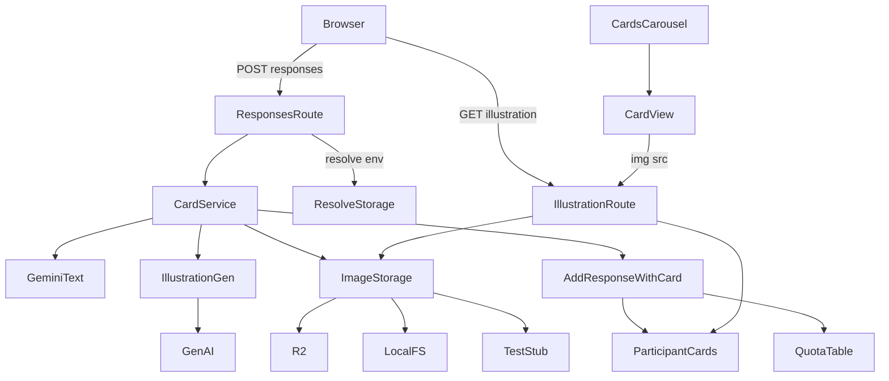
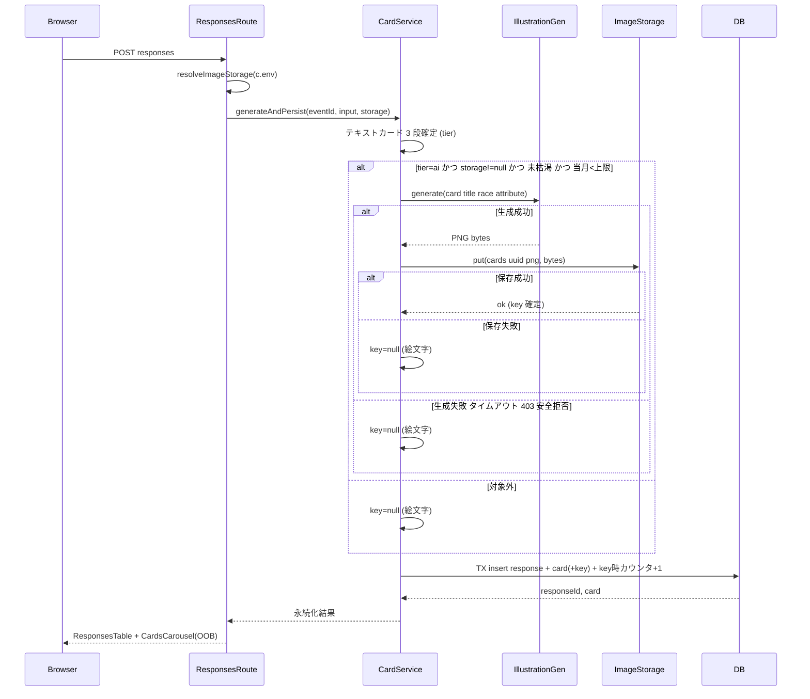
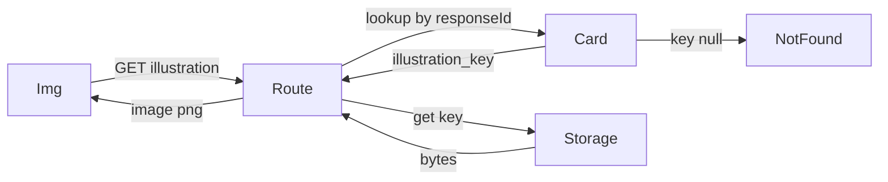
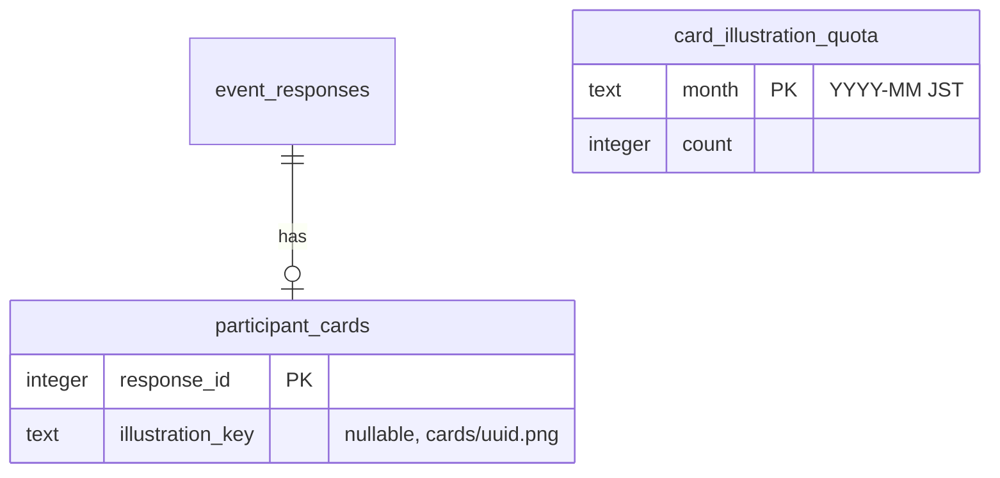

# Technical Design

## Overview

本機能は既存の参加者カード機能（`tyousei-ph2`）のアートスロット（`.yc-art-emoji` の絵文字）を、Imagen 4 Fast Generate で生成した縦長（3:4）イラスト画像に置き換える。回答送信時にテキストカードが **Tier 1（AI 生成）** に確定し、かつ当月の生成枚数が上限未満のときだけ、確定した `title`（種族・属性を補助に）からイラストを 1 枚同期生成し、Cloudflare R2 に保存する。`participant_cards` には R2 オブジェクトキーのみを永続化し、Workers の GET ルートで配信する。

**Users**: イベント参加者は自分のカードがモンスター名にちなんだイラスト付きで生成され、閲覧者は一覧でイラスト付きカード（画像が無ければ既存絵文字）を破綻なく見られる。

**Impact**: 既存の同期カード生成フロー（`POST /events/:id/responses` → `cardService.generateAndPersist` → `addResponseWithCard`）に、イラスト生成・R2 保存・月次カウンタ加算を **既存原則（カード生成失敗は回答送信を失敗にしない）を保ったまま** 差し込む。テキストカード生成ロジック（7 属性・3 段フォールバック・サニタイズ）自体は変更しない。

### Goals

- Tier 1 カード確定かつ月次上限未満のとき `title` ベースの 3:4 イラストを 1 枚生成し R2 に保存、キーを `participant_cards` に永続化する。
- 月 50 枚（全イベント合計・JST 暦月・環境変数で上書き可）のベストエフォート上限を DB 永続カウンタで管理する。
- イラスト生成・保存・取得のいずれの失敗、Tier 2/3 降格、上限到達、API キー未設定、R2 不在のすべてで既存絵文字へフォールバックし、回答送信を必ず成功させる。
- 実 Imagen API / 実 R2 に依存せずに `bun test` と Playwright E2E を完走できる差し替え機構を提供する。

### Non-Goals

- テキストカード生成ロジック（属性・3 段フォールバック・サニタイズ）の仕様変更。
- 回答編集（PUT）時のカード／イラスト再生成。イラストのユーザー編集・再生成・差し替え・削除 UI。
- SNS 共有 OGP、画像の永続外部 URL 配布、CDN 最適化、孤児 R2 オブジェクトのクリーンアップ。
- 既存テーブル（`events` / `event_options` / `event_responses` / `event_option_responses` / `event_custom_*`）のスキーマ変更。

## Boundary Commitments

### This Spec Owns

- イラスト生成サービス（Imagen 呼び出し・プロンプト構築・タイムアウト・クォータ枯渇抑止・失敗分類）。
- 画像ストレージポート（R2 / ローカル FS / テスト stub の解決と put/get）と R2 オブジェクトキーの規約（`cards/{uuid}.png`）。
- `participant_cards.illustration_key`（nullable）と月次カウンタテーブル `card_illustration_quota` の所有・整合。
- 画像配信 GET ルート（`/events/:id/responses/:responseId/illustration`）と `CardView` のイラスト/絵文字分岐。

### Out of Boundary

- テキストカードの属性決定・3 段フォールバック（`gemini.ts` / `cards.ts` の既存ロジック）。
- 既存テーブル定義と回答送信の zod バリデーション・フラグメント差し替え方式。
- 回答編集時の再生成（不変であることだけを保証）。

### Allowed Dependencies

- `@google/genai`（既存依存、Imagen 用に `generateImages` を追加利用）。
- Cloudflare R2 バインディング `CARD_ILLUSTRATIONS`（Workers ランタイムのみ、`c.env` 経由）。
- 既存 `process.env.GEMINI_API_KEY`（Imagen でも再利用、専用キーを新設しない）。
- 既存 `db.ts` のトランザクション基盤と `addResponseWithCard` フロー。

### Revalidation Triggers

- `participant_cards` のカード型（`PersistedCard`）形状変更 → `views.tsx` / `db.ts` / `cards.ts` 再確認。
- イラスト生成サービス／ストレージポートのインターフェース変更 → `cards.ts` 呼び出し側とテスト stub 再確認。
- R2 バインディング名・キー規約・GET ルート形状の変更 → `wrangler.toml` / `routes.tsx` / `CardView` 再確認。
- 同期生成方針（タイムアウト・トランザクション境界）の変更 → 回答送信フロー全体を再検証。

## Architecture

### Existing Architecture Analysis

- **2 ランタイム**: Bun（`src/index.tsx`、`bun run dev` / `bun test`）と Cloudflare Workers（`src/worker.ts` → `src/app.ts`、`wrangler deploy`）。R2 バインディングは Workers の `c.env.CARD_ILLUSTRATIONS` のみで参照でき、Bun / テストには存在しない。
- **同期カード生成**: `POST /events/:id/responses` ハンドラが `cardService.generateAndPersist` を呼び、tier 確定後に `addResponseWithCard` で回答とカードを 1 トランザクション永続化、`CardsCarousel` を OOB で差し替える。
- **プロセス外依存の差し替え**: `gemini.ts` の `setCardGeneratorForTest` / module-local `quotaExhausted` フラグが確立済み。イラストも同パターンを踏襲する。
- **フラットレイヤ構成**: `src/` 直下に責務単位でファイルを並べる（steering: structure.md）。新規も `illustration.ts` / `storage.ts` を直下に追加する。

### Architecture Pattern & Boundary Map

選択パターン: **同期インライン生成 + ランタイム解決ストレージポート**。重い外部呼び出し（Imagen / R2 put）はトランザクション外、DB 永続化（card + key + カウンタ）はトランザクション内に置く。



**Architecture Integration**:

- Selected pattern: 同期インライン生成。要件 1.5（同一同期リクエスト）/ 1.6（同一トランザクション）に直結し、Queue 等の追加インフラを持たない。
- Domain/feature boundaries: 生成（`illustration.ts`）/ 保存（`storage.ts`）/ 永続化・カウンタ（`db.ts`）/ オーケストレーション（`cards.ts`）/ 配信・表示（`routes.tsx` / `views.tsx`）を分離。
- Existing patterns preserved: 3 段フォールバック、`addResponseWithCard` の単一トランザクション、`setXxxForTest` 差し替え、フラグメント + OOB 差し替え。
- New components rationale: `illustration.ts`（Imagen はテキスト生成と別 API・別タイムアウト・別クォータ管理）、`storage.ts`（R2 はランタイム依存で `c.env` 解決が必要）。
- Steering compliance: フラット構成、相対 import、`any` 不使用、schema 由来型の利用。

### Technology Stack

| Layer                    | Choice / Version                                                                 | Role in Feature                                                                 | Notes                                    |
| ------------------------ | -------------------------------------------------------------------------------- | ------------------------------------------------------------------------------- | ---------------------------------------- |
| Frontend (View)          | Hono JSX                                                                         | `CardView` のイラスト `` / 絵文字分岐、`CardsCarousel` への `eventId` 伝播 | 既存表現層を拡張                         |
| Backend / Services       | Hono 4.x / `cards.ts` / 新 `illustration.ts` / 新 `storage.ts`                   | 生成オーケストレーション・Imagen 呼び出し・ストレージ解決                       | 既存 `routes.tsx` に GET ルート追加      |
| External API             | `@google/genai` ^2.4.0                                                           | `generateImages`（`imagen-4.0-fast-generate-001`、`aspectRatio: "3:4"`）        | `GEMINI_API_KEY` 再利用                  |
| Data / Storage           | Cloudflare R2（binding `CARD_ILLUSTRATIONS`）+ ローカル FS（dev）+ SQLite/libsql | 画像本体は R2/FS、キーとカウンタは SQLite                                       | `wrangler.toml` に `[[r2_buckets]]` 追加 |
| ORM / Migration          | drizzle-orm 0.45 / drizzle-kit                                                   | `participant_cards.illustration_key` 追加・`card_illustration_quota` 新設       | `bun run db:gen` で SQL 生成             |
| Infrastructure / Runtime | Bun + Cloudflare Workers（`nodejs_compat`）                                      | 2 ランタイムで同一コード、ストレージのみ `c.env` で解決                         | R2 は Workers のみ                       |

## File Structure Plan

フラット構成（steering: structure.md）を維持し、`src/` 直下に新規 2 ファイルを追加する。

### Directory Structure

```
src/
├── illustration.ts   # 新規: Imagen 4 Fast 呼び出し（IllustrationGenerator ポート + defaultIllustrationGenerator + setIllustrationGeneratorForTest）
├── storage.ts        # 新規: ImageStorage ポート + resolveImageStorage(env) + R2/FS アダプタ + setImageStorageForTest
├── cards.ts          # 変更: tier==="ai" 時にイラスト生成→保存→key を addResponseWithCard へ渡すオーケストレーション
├── db.ts             # 変更: addResponseWithCard に illustrationKey/カウンタ加算、getEventWithOptions に illustrationKey、月次カウンタ read 関数
├── schema.ts         # 変更: participant_cards.illustration_key 追加・card_illustration_quota テーブル追加
├── views.tsx         # 変更: CardView の img/絵文字分岐、CardsCarousel/CardView に eventId 伝播
└── routes.tsx        # 変更: POST で storage 解決し cardService へ注入、GET illustration ルート追加、Bindings 型付け
```

### Modified Files

- `src/schema.ts` — `participant_cards` に `illustrationKey: text("illustration_key")`（nullable）追加。新テーブル `card_illustration_quota`（`month` PK, `count`）と型 `CardIllustrationQuota` を追加。
- `src/db.ts` — `PersistedCard` に `illustrationKey: string | null` 追加。`addResponseWithCard` 入力に `illustrationKey?: string | null` と「key があれば当月カウンタを同トランザクションで +1」を追加。`getEventWithOptions` のカードマッピングに `illustrationKey`。新規 `getMonthlyIllustrationCount(month)`。
- `src/cards.ts` — `generateAndPersist(eventId, input, imageStorage)` に拡張し、tier==="ai" 時のイラスト生成・保存・キー算出・失敗時 null フォールバックを実装。
- `src/views.tsx` — `CardView` を `{ card, eventId }` に拡張し、`card.illustrationKey` があれば ``、無ければ既存絵文字。`CardsCarousel` に `eventId` prop。
- `src/routes.tsx` — `new Hono<{ Bindings }>()` 化。`POST /events/:id/responses` で `resolveImageStorage(c.env)` を解決し `cardService.generateAndPersist` へ注入。`GET /events/:id/responses/:responseId/illustration` 追加。`renderResponseSubmissionFragment` / `EventPage` 呼び出しに `eventId` を渡す。
- `wrangler.toml` — `[[r2_buckets]] binding = "CARD_ILLUSTRATIONS"` を追加。
- `.env.example` / `.gitignore` — Imagen 用環境変数の例と `.local-illustrations/` を追記。

> 依存方向: `schema.ts ← db.ts ← cards.ts ← routes.tsx`、`illustration.ts ← cards.ts`、`storage.ts ←（型）cards.ts /（解決）routes.tsx`、`views.tsx ← schema 型`。逆向き依存は作らない。

## System Flows

### 回答送信時のイラスト生成（同期）



主要判断: Imagen / R2 put はトランザクション外（最大 ~30s）。DB 側（card + key + カウンタ）のみ原子的。例外は `cardService` 内で握り潰し、回答送信ハンドラへ伝播させない（4.4）。

### イラスト配信



key が無い（または response が event 不一致）の場合は 404。`CardView` は key を持つカードのみ `` を描画するため通常 404 は発生しない。

## Requirements Traceability

| Requirement   | Summary                                              | Components                          | Interfaces                                                  | Flows    |
| ------------- | ---------------------------------------------------- | ----------------------------------- | ----------------------------------------------------------- | -------- |
| 1.1, 1.3      | Tier 1 かつ上限未満で生成、Tier 2/3 は画像なし       | CardService                         | `generateAndPersist`                                        | 回答送信 |
| 1.2           | Imagen 4 Fast を 3:4 1 枚で呼ぶ                      | IllustrationGenerator               | `generate`                                                  | 回答送信 |
| 1.4           | 1 送信あたり最大 1 回・リトライなし                  | CardService                         | `generateAndPersist`                                        | 回答送信 |
| 1.5           | 同一同期リクエストで完了                             | CardService                         | `generateAndPersist`                                        | 回答送信 |
| 1.6           | カードと同一トランザクションで永続化                 | DB                                  | `addResponseWithCard`                                       | 回答送信 |
| 2.1, 2.2      | R2 保存しキーを返す                                  | ImageStorage                        | `put`                                                       | 回答送信 |
| 2.3           | 本体/完全 URL を保存せずキーのみ永続化               | DB, Schema                          | `participantCards.illustrationKey`                          | 回答送信 |
| 2.4           | response ごとに一意なキー                            | CardService, DB                     | キー規約 `cards/{uuid}.png`                                 | 回答送信 |
| 2.5           | Workers GET で R2 から読み出し配信                   | IllustrationRoute, ImageStorage     | `GET .../illustration`, `get`                               | 配信     |
| 2.6           | CardView が key 由来 URL を参照                      | CardView                            | ``                                                 | 配信     |
| 3.1, 3.2      | key 有→画像 / 無→絵文字                              | CardView                            | props 分岐                                                  | 配信     |
| 3.3           | 7 属性表示を維持                                     | CardView                            | 既存描画                                                    | —        |
| 3.4           | 代替テキストに title                                 | CardView                            | ``                                                 | 配信     |
| 3.5           | ライト/ダークで破綻なし                              | CardView, app.css                   | `.yc-art-illustration`                                      | —        |
| 4.1, 4.3      | API/保存失敗で絵文字・送信成功                       | CardService                         | 例外握り潰し                                                | 回答送信 |
| 4.2           | クォータ超過で以降抑止                               | IllustrationGenerator               | `illustrationQuotaExhausted`                                | 回答送信 |
| 4.4           | 例外をハンドラへ伝播させない                         | CardService                         | `generateAndPersist`                                        | 回答送信 |
| 4.5           | API キー未設定で呼ばず絵文字                         | IllustrationGenerator               | `generate`                                                  | 回答送信 |
| 4.6           | 既定 30s タイムアウト（専用 env）                    | IllustrationGenerator               | `IMAGEN_TIMEOUT_MS`                                         | 回答送信 |
| 5.1, 5.2      | 編集で再生成せず key 不変                            | (既存 updateResponse)               | participant_cards 非更新                                    | —        |
| 5.3           | 編集フラグメントで既存イラスト再表示                 | CardsCarousel                       | DB 再読込                                                   | —        |
| 6.1, 6.2, 6.3 | プロンプトを属性から構築・参加者由来を値化・作風固定 | IllustrationGenerator               | `buildIllustrationPrompt`                                   | 回答送信 |
| 6.4           | 安全拒否を生成失敗扱い                               | IllustrationGenerator, CardService  | `generate`                                                  | 回答送信 |
| 7.1           | モデル/タイムアウト/上限を env 化                    | IllustrationGenerator, CardService  | env 変数群                                                  | —        |
| 7.2           | 専用キー新設せず GEMINI_API_KEY 再利用               | IllustrationGenerator               | `generate`                                                  | —        |
| 7.3, 7.4, 7.6 | bun test で実 API/R2 非依存・setter 提供             | IllustrationGenerator, ImageStorage | `setIllustrationGeneratorForTest`, `setImageStorageForTest` | —        |
| 7.5           | E2E で実 Imagen 非依存・決定論                       | ImageStorage, IllustrationGenerator | stub 経路                                                   | —        |
| 7.7           | dev で R2 不在でも送信成功・絵文字                   | ImageStorage                        | `resolveImageStorage`                                       | 回答送信 |
| 8.1           | 全イベント月 50 枚（env 上書き）                     | CardService                         | `CARD_ILLUSTRATION_MONTHLY_LIMIT`                           | 回答送信 |
| 8.2           | DB カウンタで永続・横断集計                          | Schema, DB                          | `card_illustration_quota`                                   | 回答送信 |
| 8.3           | JST 暦月でリセット                                   | CardService                         | `currentJstMonth`                                           | 回答送信 |
| 8.4           | 保存完了後に +1                                      | DB                                  | `addResponseWithCard`（key 時加算）                         | 回答送信 |
| 8.5, 8.6      | 上限到達で呼ばず Tier 1 のまま画像なし・送信成功     | CardService                         | 上限ガード                                                  | 回答送信 |

## Components and Interfaces

| Component              | Domain/Layer            | Intent                               | Req Coverage                 | Key Dependencies (P0/P1)                               | Contracts      |
| ---------------------- | ----------------------- | ------------------------------------ | ---------------------------- | ------------------------------------------------------ | -------------- |
| IllustrationGenerator  | Service (external)      | Imagen 4 Fast で 3:4 PNG を 1 枚生成 | 1.2, 1.4, 4.2, 4.5, 4.6, 6   | `@google/genai` (P0)                                   | Service        |
| ImageStorage           | Service (storage)       | R2/FS/stub を解決し put/get          | 2.1, 2.2, 2.5, 7.3, 7.7      | R2 binding (P0), node:fs (P1)                          | Service        |
| CardService            | Service (orchestration) | 生成→保存→キー算出→永続化指示        | 1.1, 1.3, 1.5, 4.1, 8.1, 8.5 | IllustrationGenerator (P0), ImageStorage (P0), DB (P0) | Service        |
| DB (illustration 拡張) | Data                    | キー永続化・カウンタ加算・読出       | 1.6, 2.3, 8.2, 8.4           | schema (P0)                                            | Service, State |
| IllustrationRoute      | Controller              | 画像配信 GET                         | 2.5                          | ImageStorage (P0), DB (P0)                             | API            |
| CardView               | UI                      | img/絵文字分岐・代替テキスト         | 2.6, 3.x                     | PersistedCard 型 (P0)                                  | State          |

詳細ブロックは新規境界を導入する 4 コンポーネント（IllustrationGenerator / ImageStorage / CardService / DB 拡張）に絞る。IllustrationRoute と CardView は要約 + 実装メモで足りる。

### Service Layer

#### IllustrationGenerator

| Field        | Detail                                                      |
| ------------ | ----------------------------------------------------------- |
| Intent       | 確定カード属性から Imagen 4 Fast で 3:4 PNG を 1 枚生成する |
| Requirements | 1.2, 1.4, 4.2, 4.5, 4.6, 6.1, 6.2, 6.3, 6.4, 7.1, 7.2       |

**Responsibilities & Constraints**

- `title`（中核）・`race`・`attribute` からプロンプトを構築し、参加者由来テキストを構造的区切り（`<name>…</name>` 等）で囲み「値」として扱う（6.1/6.2）。作風（カードゲームのモンスター風）と 3:4 を固定（6.3）。
- 1 回の `generate` で Imagen を最大 1 回だけ呼ぶ（リトライなし、1.4）。既定 30s タイムアウト（`IMAGEN_TIMEOUT_MS`、4.6）。
- API キー未設定（4.5）・タイムアウト・ネットワーク・5xx・安全拒否（空 `generatedImages`、6.4）は例外として投げる。403 はクォータ枯渇として module-local フラグを立て以降抑止（4.2）。
- テスト時は `setIllustrationGeneratorForTest` の stub を最優先（7.3/7.4）。実 API キー不要（7.6）。

**Dependencies**

- Outbound: CardService — 生成バイト列を返す (P0)
- External: `@google/genai` `client.models.generateImages` (P0)

**Contracts**: Service [x]

##### Service Interface

```typescript
export type CardForIllustration = {
  title: string;
  race: string;
  attribute: string;
};

export type IllustrationGenerator = {
  // 成功時は PNG バイト列。失敗（キー未設定/タイムアウト/ネットワーク/5xx/クォータ/安全拒否）は throw。
  generate(card: CardForIllustration): Promise<Uint8Array>;
};

export const defaultIllustrationGenerator: IllustrationGenerator;
export function setIllustrationGeneratorForTest(stub: IllustrationGenerator | null): void;
export function __resetIllustrationQuotaForTest(): void;
```

- Preconditions: `card.title` は既存サニタイズ済み（`cards.ts` 由来、60 文字以内）。
- Postconditions: 戻り値は非空 PNG バイト列、または例外。
- Invariants: Imagen 呼び出しは 1 回／`generate`。クォータ枯渇後は実 API を呼ばない。

**Implementation Notes**

- Integration: `gemini.ts` と同じ `Promise.race([sdkCall, timeout])` 方式。`config: { numberOfImages: 1, aspectRatio: "3:4" }`、`model: process.env.IMAGEN_MODEL ?? "imagen-4.0-fast-generate-001"`。`response.generatedImages?.[0]?.image?.imageBytes`（base64）を `Uint8Array` 化。
- Validation: `imageBytes` が空/未定義なら安全拒否扱いで throw（6.4）。
- Risks: 同期 30s ブロック。失敗分類は `gemini.ts` の `extractStatus` 同様（403→quota, 5xx→transient）。

#### ImageStorage

| Field        | Detail                                                                                  |
| ------------ | --------------------------------------------------------------------------------------- |
| Intent       | ランタイムに応じて R2 / ローカル FS / テスト stub を解決し、画像の put/get を抽象化する |
| Requirements | 2.1, 2.2, 2.5, 7.3, 7.5, 7.6, 7.7                                                       |

**Responsibilities & Constraints**

- `resolveImageStorage(env)` の優先順: (1) `setImageStorageForTest` の stub、(2) `env.CARD_ILLUSTRATIONS`（R2 バインディング）→ R2 アダプタ、(3) Bun ランタイム（`typeof Bun !== "undefined"`）→ ローカル FS アダプタ（既定 `.local-illustrations/`、`CARD_ILLUSTRATION_LOCAL_DIR` で上書き）、(4) いずれでもない → `null`（絵文字フォールバック、7.7）。
- `put(key, bytes, contentType)` は冪等な上書き保存。`get(key)` は存在すればバイト列と content-type、無ければ `null`。
- 型安全のため `@cloudflare/workers-types` を導入せず、使用メソッドのみの最小構造型を本モジュールに定義（`any` 不使用）。

**Dependencies**

- Inbound: CardService（put）、IllustrationRoute（get） (P0)
- External: R2 バインディング `CARD_ILLUSTRATIONS`（Workers のみ）(P0) / `node:fs/promises`（dev）(P1)

**Contracts**: Service [x]

##### Service Interface

```typescript
export type StoredImage = { bytes: Uint8Array; contentType: string };

export type ImageStorage = {
  put(key: string, bytes: Uint8Array, contentType: string): Promise<void>;
  get(key: string): Promise<StoredImage | null>;
};

// R2 バインディングの最小構造型（@cloudflare/workers-types 非依存）
export type R2BucketLike = {
  put(key: string, value: ArrayBuffer | Uint8Array): Promise<unknown>;
  get(key: string): Promise<{ arrayBuffer(): Promise<ArrayBuffer> } | null>;
};

export function resolveImageStorage(env: unknown): ImageStorage | null;
export function setImageStorageForTest(stub: ImageStorage | null): void;
```

- Preconditions: `key` は `cards/{uuid}.png` 形式（CardService が生成）。
- Postconditions: `put` 成功で `get(key)` が同一バイト列を返す。
- Invariants: content-type は `image/png` 固定（本機能の生成物は PNG）。

**Implementation Notes**

- Integration: R2 アダプタは `bucket.put(key, bytes)` / `bucket.get(key)?.arrayBuffer()`。FS アダプタは key をディレクトリ配下のパスに正規化（`/` をパス区切りに）。
- Validation: `resolveImageStorage` は env を構造的に判定（`CARD_ILLUSTRATIONS` プロパティの有無）。
- Risks: dev FS 書込権限。Workers でバインディング欠落時は `null` を返し誤って FS を使わない。

### Orchestration Layer

#### CardService（拡張）

| Field        | Detail                                                                     |
| ------------ | -------------------------------------------------------------------------- |
| Intent       | テキストカード確定後、条件を満たせばイラスト生成→保存→キーを永続化指示する |
| Requirements | 1.1, 1.3, 1.4, 1.5, 4.1, 4.3, 4.4, 6.4, 8.1, 8.3, 8.5, 8.6                 |

**Responsibilities & Constraints**

- 既存 3 段フォールバックは不変。tier 確定後、`tier==="ai"` のときのみイラスト生成を試みる（1.1/1.3）。
- ガード順: `tier==="ai"` → `imageStorage != null` → 当月カウント `< 上限`（`getMonthlyIllustrationCount`、`CARD_ILLUSTRATION_MONTHLY_LIMIT` 既定 50、8.1/8.5）。すべて満たすとき 1 回だけ `generate`（1.4）。
- 生成・保存中の **あらゆる例外を握り潰し** `illustrationKey=null` にフォールバックし、回答送信ハンドラへ伝播させない（4.1/4.3/4.4/6.4）。
- key 算出は `cards/${crypto.randomUUID()}.png`（2.4）。永続化と key 有時のカウンタ +1 は `addResponseWithCard` の単一トランザクションに委譲（1.6/8.4）。
- 月キーは `currentJstMonth()`（UTC+9 の `YYYY-MM`、8.3）。

**Dependencies**

- Inbound: ResponsesRoute（`generateAndPersist`）(P0)
- Outbound: IllustrationGenerator（生成）/ ImageStorage（保存）/ DB（`getMonthlyIllustrationCount`, `addResponseWithCard`）(P0)

**Contracts**: Service [x]

##### Service Interface

```typescript
export const cardService = {
  generateAndPersist(
    eventId: string,
    input: ResponseSubmissionInput,
    imageStorage: ImageStorage | null,
  ): Promise<{ responseId: number; card: PersistedCard }>;
};
```

- Preconditions: `imageStorage` は呼び出し側（route）が `resolveImageStorage(c.env)` で解決済み。
- Postconditions: 戻り値 `card.illustrationKey` は生成成功時のみ非 null。返却カードは必ず永続化済み。
- Invariants: 1 送信あたり Imagen 呼び出しは最大 1 回・リトライなし。例外は呼び出し側へ漏らさない。

**Implementation Notes**

- Integration: 既存 `generateAndPersist` のシグネチャに `imageStorage` を追加（route 側も更新）。生成・保存は `try/catch` で囲み失敗時 `key=null`。
- Validation: 上限チェックは生成直前の単純読取（ベストエフォート、TOCTOU 許容）。
- Risks: ベストエフォートのため並行時に数枚超過しうる（設計判断として受容、`research.md` 参照）。

### Data Layer

#### DB（illustration 拡張）

| Field        | Detail                                                                          |
| ------------ | ------------------------------------------------------------------------------- |
| Intent       | キー永続化・月次カウンタ加算を単一トランザクションで行い、読出系に key を含める |
| Requirements | 1.6, 2.3, 8.2, 8.4                                                              |

**Responsibilities & Constraints**

- `addResponseWithCard` 入力に `illustrationKey?: string | null` と `quotaMonth?: string` を追加。トランザクション内で response → card(+illustrationKey) を insert し、`illustrationKey` が非 null かつ `quotaMonth` 指定時のみ `card_illustration_quota` を upsert で +1（1.6/8.4）。
- `participant_cards` は本体・完全 URL を保存せずキーのみ（2.3）。
- `getEventWithOptions` のカードマッピングに `illustrationKey` を含める。`getMonthlyIllustrationCount(month)` は当月行が無ければ 0（8.2）。

**Contracts**: Service [x] / State [x]

##### Service Interface

```typescript
export interface AddResponseWithCardInput {
  response: ResponseInput;
  card: CardAttributes & { tier: Tier };
  illustrationKey?: string | null; // 既定 null
  quotaMonth?: string; // 指定かつ illustrationKey 非 null のとき +1
}

export function getMonthlyIllustrationCount(month: string): Promise<number>;
// PersistedCard に illustrationKey: string | null を追加
```

##### State Management

- State model: `card_illustration_quota(month TEXT PK, count INTEGER NOT NULL DEFAULT 0)`。`participant_cards.illustration_key TEXT`（nullable）。
- Persistence & consistency: カウンタ +1 と card 永続化は同一トランザクション。upsert は `INSERT ... ON CONFLICT(month) DO UPDATE SET count = count + 1`。
- Concurrency strategy: ベストエフォート（原子的予約なし）。SQLite の単一書込で行レベル整合は確保。

**Implementation Notes**

- Integration: `getEventWithOptions` の `select()` は列追加で自動取得。マッピングに `illustrationKey: c.illustrationKey` を追加。
- Risks: 複数インスタンス/同時書込でのカウンタは厳密でないが暦月集計として一貫（8.2）。

### Controller / UI（要約）

#### IllustrationRoute

- Intent: `GET /events/:id/responses/:responseId/illustration` で R2/FS から画像を配信（2.5）。Contracts: API。
- API Contract:

| Method | Endpoint                                       | Request     | Response                 | Errors                                           |
| ------ | ---------------------------------------------- | ----------- | ------------------------ | ------------------------------------------------ |
| GET    | /events/:id/responses/:responseId/illustration | path params | 200 `image/png`（bytes） | 404（response 不一致 / key 無 / オブジェクト無） |

- Implementation Note: responseId から card 行を引き `illustrationKey` を取得。`event` 不一致や key 無は 404。`resolveImageStorage(c.env)` で `get(key)` し `c.body(bytes, 200, { "Content-Type": "image/png", "Cache-Control": "public, max-age=31536000, immutable" })`。キーは UUID で不変のため長期キャッシュ可。

#### CardView（拡張）

- Intent: `card.illustrationKey` があれば ``、無ければ既存種族別絵文字（無ければ `✨`）を表示（3.1/3.2）。Contracts: State（props のみ）。
- Implementation Note: props を `{ card: PersistedCard; eventId: string }` に拡張。`.yc-art` 内の `.yc-art-emoji` を、key 有時 `` に差し替え（`alt` に title、3.4）。レアリティ枠・属性・種族・ATK/DEF・フレーバーは不変（3.3）。`CardsCarousel` に `eventId` prop を追加し全 `CardView` へ伝播。`public/app.css` に `.yc-art-illustration`（`width:100%; height:100%; object-fit:cover`）を追加しライト/ダーク両対応（3.5）。

## Data Models

### Logical Data Model

- `participant_cards`（既存、1 行 = 1 response の card）に `illustration_key TEXT`（nullable）を追加。`response_id` が PK のため card 行が response と 1:1。`illustration_key` は当該 response のイラストを一意に指す（2.4）。
- `card_illustration_quota`（新規）: `month TEXT PRIMARY KEY`（`YYYY-MM`、JST 暦月）、`count INTEGER NOT NULL DEFAULT 0`。全イベント横断の月次集計（8.2）。



### Migration

- `bun run db:gen` で `participant_cards.illustration_key` 追加と `card_illustration_quota` 作成の SQL を生成（既存テーブルへの additive 変更のみ、データ移行不要）。生成 SQL は手書き編集しない（steering）。既存 card 行の `illustration_key` は NULL（絵文字表示）。

## Error Handling

### Error Strategy

イラストは **常に best-effort 拡張**。失敗は回答送信を妨げない（既存「カード生成失敗は送信を失敗にしない」原則の継承）。

### Error Categories and Responses

- **生成失敗**（タイムアウト/ネットワーク/5xx/安全拒否、4.1/6.4）: `IllustrationGenerator.generate` が throw → CardService が捕捉し `key=null` → 絵文字で永続化・送信成功。
- **クォータ超過**（403、4.2）: module-local `illustrationQuotaExhausted=true`、以降同プロセスで生成抑止。当該カードは絵文字。
- **API キー未設定**（4.5）: `generate` が即 throw → 絵文字。
- **保存失敗**（R2/FS、4.3）: `put` が throw → CardService 捕捉 → 絵文字。
- **R2 不在 dev/誤設定**（7.7）: `resolveImageStorage` が `null` → 生成自体スキップ → 絵文字。
- **上限到達**（8.5/8.6）: 生成スキップ、Tier 1 のまま画像なし、送信成功。
- **配信時 key/オブジェクト無**: GET は 404（`CardView` は通常 key 有のみ参照）。

### Monitoring

- `console.warn` でイラスト失敗理由（kind: timeout/quota/network/safety/storage）を記録。回答送信は成功扱いのためエラーレスポンスにはしない。

## Testing Strategy

### Unit Tests

- `IllustrationGenerator`: stub 差し替え時に stub が呼ばれる / 安全拒否（空 `generatedImages`）で throw / 403 でクォータ枯渇フラグ。
- `currentJstMonth`: UTC 月末 15:00（JST 翌月 0:00）境界で翌月キーになる。
- `resolveImageStorage`: stub 設定時 stub / `CARD_ILLUSTRATIONS` 有で R2 アダプタ / Bun で FS / それ以外 null。

### Integration Tests（`bun test`、実 DB + stub 生成器/ストレージ）

- Tier 1 確定 + 上限未満: `generate`→`put`→`participant_cards.illustration_key` 非 null + 当月カウンタ +1。
- Tier 2/3: 生成器未呼び出し・`illustration_key` null・カウンタ不変（1.3）。
- 生成 throw / put throw: `illustration_key` null・送信 200・回答永続化（4.1/4.3）。
- 上限到達: 生成器未呼び出し・Tier 1 のまま key null・カウンタ不変（8.5）。
- 編集（PUT）: `illustration_key` 不変・カウンタ不変（5.1/5.2）。
- GET illustration: 保存済み key で 200 + bytes、key 無/不一致で 404（2.5）。

### E2E Tests（Playwright、stub ストレージで決定論、7.5）

- 回答送信でイラスト付きカードが表示される（`` が `.yc-art` 内に存在）。
- 上限到達相当の設定で絵文字フォールバック表示。
- 異常系: 生成失敗 stub で絵文字表示・送信成功。

## Security Considerations

- **プロンプトインジェクション防止**（6.1/6.2）: 参加者由来の `title` 等を `<name>…</name>` 等の構造的区切りで囲み「値であり指示でない」と明示。作風・3:4 は固定文で指定。
- **画像キーの非列挙性**: UUID キーで他者の画像 URL を推測困難に（公開イベントページ向けの防御）。GET は responseId スコープで event 一致を検証。
- **コンテンツ安全性**: Imagen 安全フィルタ拒否時は生成失敗として絵文字へ（6.4）。

## Configuration

| Env Var                           | Default                        | Role                                              |
| --------------------------------- | ------------------------------ | ------------------------------------------------- |
| `GEMINI_API_KEY`                  | （未設定で絵文字）             | Imagen でも再利用（専用キー新設なし、7.2/4.5）    |
| `IMAGEN_MODEL`                    | `imagen-4.0-fast-generate-001` | Imagen モデル ID（7.1）                           |
| `IMAGEN_TIMEOUT_MS`               | `30000`                        | イラスト生成タイムアウト（テキストと別、4.6/7.1） |
| `CARD_ILLUSTRATION_MONTHLY_LIMIT` | `50`                           | 月次上限（全イベント合計、8.1）                   |
| `CARD_ILLUSTRATION_LOCAL_DIR`     | `.local-illustrations`         | dev FS アダプタの保存先                           |

- `wrangler.toml` に `[[r2_buckets]] binding = "CARD_ILLUSTRATIONS"`（`bucket_name` は運用で作成・設定）を追加。`.gitignore` に `.local-illustrations/` を追加。`.env.example` に上記 Imagen 系変数の例を追記。
