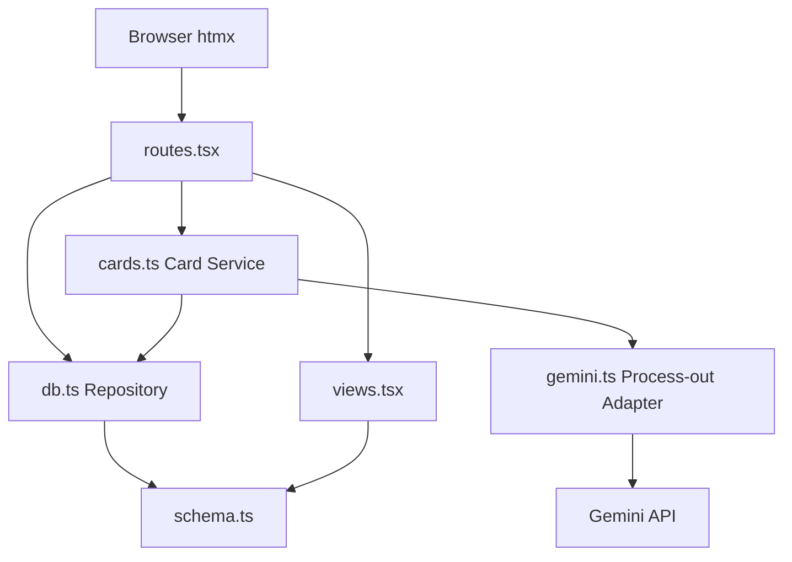
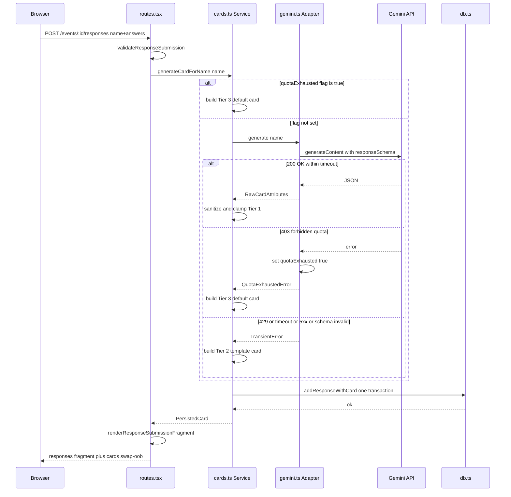
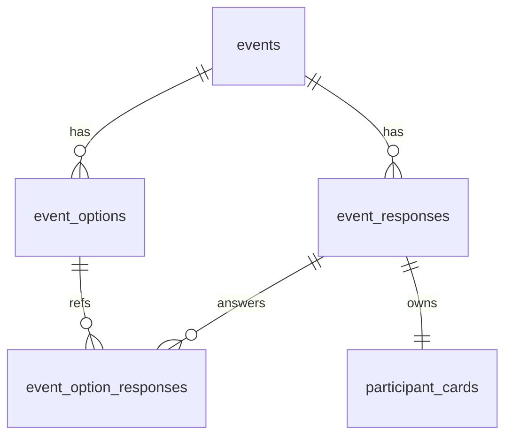
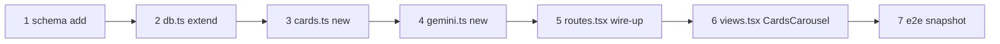

# Technical Design — tyousei-ph2（参加者カード拡張）

## Overview

**Purpose**: 既存の出欠調整スタックに「参加者カード（遊戯王風）」を追加し、回答送信時に参加者名から AI で 7 属性を持つテキストカードを生成して、イベント詳細ページ上部のカルーセルに横並び表示する。
**Users**: イベント参加者（自分の出席表明をガチャ的体験として楽しむ）、閲覧者（誰が回答済みかと各人の個性を一覧で把握する）。
**Impact**: 既存テーブルには触れず、新規 `participant_cards` テーブルと `src/cards.ts`（Service）/ `src/gemini.ts`（プロセス外ラッパ）を追加する。`POST /events/:id/responses` のレスポンスを `hx-swap-oob` で `#cards` 領域も同時更新する形に拡張する（既存 `#responses` 経路は無改変）。

### Goals

- 参加者が回答を送信した瞬間に、その参加者の名前から遊戯王風カード 1 枚を確定的に生成し永続化する。
- AI が利用できない（タイムアウト / 5xx / 429 / 403）状況でも回答送信フローを必ず成功させ、Tier 2（テンプレ）または Tier 3（最低限デフォルト）でカードを永続化する。
- 既存テーブル（`events` / `event_options` / `event_responses` / `event_option_responses`）の列・インデックス・制約を一切変更しない。

### Non-Goals

- カードのイラスト / 画像生成、SNS 共有 OGP、永続 URL。
- カード同士のバトル / コレクション / 並べ替え / ゲーム性。
- カードのユーザー編集、再生成 UI、主催者によるカード削除 / 非表示制御。
- AI モデル選択 UI、プロンプトのユーザー編集、Gemini 有料枠運用、カード多言語対応。

## Boundary Commitments

### This Spec Owns

- 「参加者カード」ドメイン: 7 属性（二つ名 / レアリティ / 属性 / 種族 / フレーバーテキスト / 攻撃力 / 守備力）の生成・永続化・表示。
- 新規テーブル `participant_cards`（PK = `response_id`）と関連マイグレーション。
- Gemini API クライアントの初回導入（`src/gemini.ts`）と 3 段フォールバック戦略の所有。
- カルーセル UI コンポーネント（`CardsCarousel` / `CardView`）と `#cards` 領域の htmx 連動。

### Out of Boundary

- 出欠調整の主機能（候補選択・集計・編集）— 既存挙動を一切変えない。
- `event_responses` および周辺 4 テーブルのスキーマ変更。
- `slack_webhooks` テーブル（本仕様では参照も拡張も行わない）。
- カード関連の永続 URL / SNS 共有 / バトル / 再生成 UI。
- AI モデル選択 UI、プロンプトのエンドユーザー編集。

### Allowed Dependencies

- 既存 `db.ts` のトランザクション境界（`db.transaction(async (tx) => ...)`）。
- 既存 `views.tsx` の `Layout` / `EventPage` 構造（`#responses` の隣に `#cards` を増設する形）。
- 既存 `routes.tsx` のフラグメント返却規約（`hx-target` と `hx-swap-oob` の併用）。
- `@google/genai` npm パッケージ（本仕様で新規追加）。
- `GEMINI_API_KEY` 等の環境変数（`.env` / `.env.test` で差し替え可能）。

### Revalidation Triggers

- `event_responses` の PK 型が `integer` 以外に変わる（`participant_cards.response_id` FK が成立しなくなる）。
- `getEventWithOptions(eventId)` の返却契約が変わる（カード結合の前提が崩れる）。
- フラグメント返却規約（`hx-target` / `hx-swap-oob` の使い分け）が変わる。
- Gemini API のレスポンス形式や認証スキームが変わる（`gemini.ts` の `CardGenerator` 型を更新）。
- 単一プロセス前提が崩れる（クォータフラグの module-local 保持が成立しなくなる）。

## Architecture

### Existing Architecture Analysis

本リポジトリは `src/` 直下のフラットなレイヤー分割。依存方向は `index.tsx → routes.tsx → { views.tsx, db.ts }`、`db.ts → schema.ts`、`views.tsx → schema.ts`（型のみ）。フルページ vs フラグメント vs `HX-Refresh` の使い分けがプロジェクト中核の設計判断。本拡張も同じレイヤー分割を踏襲し、サブディレクトリは切らない（steering `structure.md` 準拠）。

### Architecture Pattern & Boundary Map



**Architecture Integration**:

- Selected pattern: 既存のレイヤー分割（Hono + JSX + Drizzle）の延長。Card Service を追加する Hexagonal 風の分離（プロセス外依存だけを `type` で抽象化）。
- Domain/feature boundaries: `routes` は HTTP I/O、`cards` はカード生成オーケストレーションと永続化、`gemini` は Gemini API 呼び出しとプロセス内クォータ管理、`db` は SQL アクセスと型、`views` は表示のみ。
- Existing patterns preserved: フラットレイアウト、`schema → db → routes → views` の一方向依存、フラグメント返却規約、`bun:test` での実 DB 統合テスト、古典派 TDD。
- New components rationale:
  - `cards.ts` — 3 段フォールバック + 同一トランザクションでの回答 + カード書き込み。`routes` を薄く保つために必須。
  - `gemini.ts` — プロセス外依存。テスト時に差し替え可能な `CardGenerator` 型を提供し、`bun test` を実 API 非依存にする（古典派 TDD のプロセス外依存モック方針に従う）。
- Steering compliance: `tech.md` の Type Safety / フラグメント規約 / `.env.test` 運用 / 古典派 TDD を遵守。

### Technology Stack

| Layer                    | Choice / Version                                      | Role in Feature                                                                    | Notes                                                                                                                      |
| ------------------------ | ----------------------------------------------------- | ---------------------------------------------------------------------------------- | -------------------------------------------------------------------------------------------------------------------------- |
| Frontend / CLI           | htmx 2.x + hono/jsx + pico.css v2                     | カルーセル UI とフラグメント差し替え                                               | `hx-swap-oob` で `#cards` を `#responses` と同時更新（既存規約と整合）                                                     |
| Backend / Services       | Hono 4.x（Bun）+ TypeScript strict                    | 新規 Card Service、`POST /events/:id/responses` の拡張                             | 既存 `routes.tsx` を最小差分で拡張、Service ロジックは `cards.ts` に分離                                                   |
| Data / Storage           | libsql / SQLite + drizzle-orm 0.45 + drizzle-kit 0.31 | 新規 `participant_cards` テーブル（PK = `response_id`、`event_responses` への FK） | 既存テーブルは無改変。マイグレーション `0001_*.sql` を `drizzle-kit generate` で生成                                       |
| Messaging / Events       | （該当なし）                                          | —                                                                                  | キュー / Pub-Sub は導入しない。AI 呼び出しは同期 + タイムアウト                                                            |
| Infrastructure / Runtime | Bun（最新）+ `@google/genai`（新規）                  | Gemini API 呼び出し                                                                | `GEMINI_API_KEY` を `.env` から読む。テストは Stub を差し替えて実 API を呼ばない（`.env.test` 不要）。詳細は `research.md` |

### Gemini API セットアップ手順（ユーザー操作）

本仕様は AI API クライアントの初回導入であり、開発者が本機能を動作させるには以下の事前準備が必要となる。これらは実装フェーズ前または起動前に必ず完了させる。

**1. API キーの取得（ユーザー操作）**

- [Google AI Studio](https://aistudio.google.com/app/apikey) にアクセスし、Google アカウントでログイン。
- 「Create API key」から無料枠の API キーを発行する。
- 発行されたキー文字列を控える（再表示できない場合があるため）。
- Google Cloud のプロジェクト紐付けは任意。無料枠運用の範囲ではプロジェクトなしで利用可能。

**2. 依存関係の追加（コマンド）**

```bash
bun add @google/genai
```

`package.json` の `dependencies` に `@google/genai` が追加される。

**3. 環境変数の設定**

ユーザー（開発者）は以下を `.env` に追加する。`.env.example` にもプレースホルダ付きで反映し、git 管理する。

| Variable                   | Required | 目的                     | Default                                       |
| -------------------------- | -------- | ------------------------ | --------------------------------------------- |
| `GEMINI_API_KEY`           | 推奨     | API 認証                 | （未設定なら起動時警告 + 常に Tier 3 で稼働） |
| `GEMINI_MODEL`             | 任意     | 使用モデル名             | `gemini-2.0-flash`                            |
| `GEMINI_TIMEOUT_MS`        | 任意     | 単一呼び出しタイムアウト | `4000`                                        |
| `GEMINI_TEMPERATURE`       | 任意     | 生成温度                 | `0.9`                                         |
| `GEMINI_MAX_OUTPUT_TOKENS` | 任意     | 出力トークン上限         | `256`                                         |

**4. 疎通確認（オプトイン / 手動）**

- **デフォルトは無効**。`bun run dev --hot` でホットリロード時に Gemini 無料枠を消費しないため、起動時の自動疎通確認は **行わない**。
- **オプトイン**: 環境変数 `GEMINI_VERIFY_ON_BOOT=1` を設定したときだけ、起動シーケンスから `defaultCardGenerator.verifyConnectivity()` を 1 回実行し、結果を `console.info` / `console.warn` で報告する。失敗してもアプリ起動は止めない。
  - `ok: true` → 通常稼働（Tier 1 経路が有効）
  - `ok: false, reason: "missing_api_key"` → 起動時警告 1 回、以降は AI を呼ばず Tier 3 固定
  - `ok: false, reason: "auth_failed" | "network" | "timeout"` → 起動時警告 1 回、本機能の通常フォールバック経路に委譲（次回呼び出しで再判定）
- **暗黙の判定**: `GEMINI_API_KEY` が未設定の場合は、起動シーケンスではなく初回 `generate()` 呼び出し時に検出し、`QuotaExhaustedError` 相当として扱って Tier 3 固定にする（追加 API リクエストなし）。
- **手動**: 開発者が `bun run src/gemini.ts --verify` 等のワンライナーで疎通確認できるよう、`gemini.ts` に `if (import.meta.main) ...` の簡易エントリを置く（任意）。

**5. テスト環境での扱い（テスト哲学準拠）**

- `bun test`（単体・統合）では **`GEMINI_API_KEY` を設定しない**。`.env.test` にも追加しない。
- すべてのテストで `setCardGeneratorForTest(stub)` を `beforeEach` で呼び、プロセス外依存（Gemini API）を完全にスタブ化する（プロセス外依存はモックする古典派 TDD の方針）。
- `bun run test:e2e`（Playwright）でも同様に Gemini を呼ばないモードで起動する。`playwright.config.ts` の `webServer.env` に `GEMINI_TEST_STUB=tier2`（実装側で読む）等を渡し、`defaultCardGenerator` を内蔵スタブに差し替える。
- 結果として、**テスト実行に Gemini API キーは一切不要**。CI で `GEMINI_API_KEY` シークレットの登録は行わない。

## File Structure Plan

### Directory Structure

```
src/
├── cards.ts        # 新規: Card Service。3 段フォールバック・サニタイズ・永続化オーケストレーション
├── gemini.ts       # 新規: Gemini API クライアント（type CardGenerator 実装）とクォータフラグ
├── schema.ts       # 拡張: participantCards テーブル定義 + 型エクスポート
├── db.ts           # 拡張: addResponseWithCard / getEventWithCards / Card 永続化補助
├── routes.tsx      # 拡張: POST /events/:id/responses でカード生成を呼ぶ。renderResponseSubmissionFragment 追加
├── views.tsx       # 拡張: CardsCarousel / CardView コンポーネント。EventPage に #cards 領域を追加
├── index.tsx       # 無改変
└── *.test.ts       # 拡張: cards.test.ts / gemini.test.ts / routes.test.ts の追加ケース
drizzle/
└── 0001_*.sql      # 新規: participant_cards 作成マイグレーション（自動生成）
public/
└── app.css         # 任意拡張: カード装飾のスコープ付き CSS を追記
```

### Modified Files

- `src/schema.ts` — `participantCards` テーブル定義と `ParticipantCard` 型をエクスポート（既存テーブルは無改変）。
- `src/db.ts` — `EventWithOptions` 型を拡張してレスポンス行に `card: ParticipantCard | null` を追加。`addResponse` は触らず、新規 `addResponseWithCard(eventId, input, card)` を Card Service が呼ぶ。
- `src/routes.tsx` — `POST /events/:id/responses` ハンドラ内で `cards.generateCardForName(name)` を呼び、生成結果を `addResponseWithCard` に渡す。`renderResponseSubmissionFragment` を新設（`#responses` + `#cards` の 2 領域フラグメント）。`PUT` 経路はカード変更しない（`#cards` 再送のみ）。
- `src/views.tsx` — `EventPage` に `<div id="cards">` を `<div id="responses">` の **直前** に挿入。`CardsCarousel` / `CardView` を export。
- `src/index.tsx` — 起動シーケンスに `if (process.env.GEMINI_VERIFY_ON_BOOT === "1") await defaultCardGenerator.verifyConnectivity()` の **オプトイン** フックを追加。デフォルトでは実 API リクエストを発生させない（ホットリロードで無料枠を消費しないため）。失敗してもアプリ起動は止めない。
- `package.json` — `@google/genai` を追加。
- `.env` / `.env.example` — `GEMINI_API_KEY` ほか Gemini 関連の任意変数を追加（詳細は「Gemini API セットアップ手順」§3）。

## System Flows

### 回答送信フロー（Tier 1 成功 / Tier 2 / Tier 3 の分岐）



**Key Decisions**:

- AI 呼び出しは **トランザクション外**（DB ロック保持時間を最小化）。`cards.ts` は AI 応答を保持してから `db.transaction` 内で `event_responses` と `participant_cards` を一括 INSERT。
- 編集（PUT）経路はこのフローを **通らない**（Card Service を呼ばない）。`#cards` には現状のカード集合を再送するだけ。
- `quotaExhausted` は `gemini.ts` の module-local。`__resetQuotaForTest()` でテスト時にリセット。

## Requirements Traceability

| Requirement | Summary                                                                                 | Components             | Interfaces                                                                                             | Flows                                |
| ----------- | --------------------------------------------------------------------------------------- | ---------------------- | ------------------------------------------------------------------------------------------------------ | ------------------------------------ |
| 1.1         | 新規回答送信時に同一トランザクションでカードを 1 件永続化                               | routes / cards / db    | `POST /events/:id/responses`、`CardService.generateCardForName`、`addResponseWithCard`                 | 回答送信フロー                       |
| 1.2         | 7 属性を保持                                                                            | schema / cards         | `participantCards` 列、`PersistedCard`                                                                 | —                                    |
| 1.3         | 回答 1 件につきカード 1 件を保証                                                        | schema                 | `participant_cards.response_id PRIMARY KEY` + FK                                                       | —                                    |
| 1.4         | 編集時はカード再生成しない                                                              | routes                 | `PUT /events/:id/responses/:responseId`（Card Service を呼ばない）                                     | —                                    |
| 1.5         | 二つ名に参加者名を必ず含める                                                            | cards                  | `sanitizeTitle(name, raw)`                                                                             | 回答送信フロー（Tier 1/2/3 全 Tier） |
| 1.6         | 各文字列を上限文字数で切り詰める                                                        | cards                  | `clampString` / 上限値定数                                                                             | —                                    |
| 2.1         | カルーセルを最上部に表示                                                                | views                  | `EventPage` の DOM 順序                                                                                | —                                    |
| 2.2         | 各カードを 1 枚ずつ描画                                                                 | views                  | `CardsCarousel` / `CardView`                                                                           | —                                    |
| 2.3         | 0 件時はカルーセルを非表示または空状態メッセージ                                        | views                  | `CardsCarousel` の `responses.length === 0` 分岐                                                       | —                                    |
| 2.4         | htmx 差し替えで新カードを追加                                                           | routes / views         | `renderResponseSubmissionFragment`（`#cards` を `hx-swap-oob`）                                        | 回答送信フロー                       |
| 2.5         | 回答送信順（古い → 新しい）で並べる                                                     | db / views             | `eventResponses.id ASC` の既存 ORDER に紐付く                                                          | —                                    |
| 2.6         | 横スクロール / スワイプ / ボタンのいずれかでスクロール可能                              | views                  | `CardsCarousel` の CSS（`overflow-x: auto`）                                                           | —                                    |
| 3.1         | 7 属性すべてを視覚的に提示                                                              | views                  | `CardView`                                                                                             | —                                    |
| 3.2         | レアリティで枠の色 / 装飾を変える                                                       | views                  | `CardView` の `rarityClass` マッピング                                                                 | —                                    |
| 3.3         | 属性をバッジ表示                                                                        | views                  | `CardView` の `attributeBadge`                                                                         | —                                    |
| 3.4         | 種族を文字列として表示                                                                  | views                  | `CardView`                                                                                             | —                                    |
| 3.5         | ATK / DEF 風の数値ペア                                                                  | views                  | `CardView`                                                                                             | —                                    |
| 3.6         | イラスト枠は必須でない                                                                  | views                  | `CardView`（イラスト要素を持たない）                                                                   | —                                    |
| 3.7         | pico.css 配色変数尊重、ライト / ダーク両対応                                            | views / public/app.css | `--pico-*` 変数の参照                                                                                  | —                                    |
| 3.8         | スクリーンリーダー向けラベル                                                            | views                  | `CardView` の `aria-label` / `<figcaption>` 相当                                                       | —                                    |
| 4.1         | タイムアウト内成功時は Tier 1 として永続化                                              | cards / gemini         | `CardGenerator.generate`、`TIER_1`                                                                     | 回答送信フロー（成功）               |
| 4.2         | 一時失敗時は Tier 2 テンプレで永続化                                                    | cards                  | `buildTemplateCard(name)`                                                                              | 回答送信フロー（Tier 2）             |
| 4.3         | クォータ超過時は Tier 3 を永続化し以降抑止（判定基準: `403` のみ。`429` 単発は Tier 2） | gemini / cards         | `QuotaExhaustedError`（403）、`TransientError("rate_limited")`（429）、`quotaExhausted` フラグ         | 回答送信フロー（Tier 3）             |
| 4.4         | いずれの Tier でも回答送信を失敗扱いにしない                                            | routes / cards         | `generateCardForName` は throw しない（必ず `PersistedCard` 相当を返す）                               | 回答送信フロー（全分岐）             |
| 4.5         | プロンプトインジェクション対策（参加者名の引用区切り）                                  | gemini                 | `buildPrompt(name)`（`<participant_name>...</participant_name>` 構造化）                               | —                                    |
| 4.6         | レアリティ / 属性 / 種族の存在 + 文字列型検証 + サニタイズ                              | cards                  | `sanitizeRawCard(raw)`                                                                                 | —                                    |
| 4.7         | 攻撃力 / 守備力のクランプ                                                               | cards                  | `clampStat(n)`                                                                                         | —                                    |
| 4.8         | クォータ枯渇フラグ立ち時は AI を呼ばず Tier 3                                           | gemini / cards         | `quotaExhausted` チェック分岐                                                                          | 回答送信フロー（Tier 3）             |
| 5.1         | 7 属性を `event_responses` に 1:1 で永続化                                              | schema / db            | `participantCards` テーブル                                                                            | —                                    |
| 5.2         | 既存テーブルを破壊的に変更しない                                                        | schema                 | `events` / `eventOptions` / `eventResponses` / `eventOptionResponses` を編集しない                     | —                                    |
| 5.3         | 取得処理がカードを併せて返す                                                            | db                     | `getEventWithOptions` の返却型を `responses[].card` 拡張                                               | —                                    |
| 5.4         | カードと回答を同一トランザクションで永続化                                              | db / cards             | `addResponseWithCard(eventId, input, card)`（`db.transaction`）                                        | 回答送信フロー                       |
| 5.5         | カード未紐付け時はフォールバック表示                                                    | views                  | `CardView` の `card === null` 分岐                                                                     | —                                    |
| 6.1         | 回答テーブルとカルーセルを部分更新                                                      | routes                 | `renderResponseSubmissionFragment`                                                                     | 回答送信フロー                       |
| 6.2         | 2 領域を含む or `hx-swap-oob` で同時更新                                                | routes / views         | レスポンス本文 = `#responses` + `#cards hx-swap-oob`                                                   | —                                    |
| 6.3         | 初回 GET でカルーセルも正しく描画                                                       | routes / views         | `EventPage` の DOM 構造                                                                                | —                                    |
| 6.4         | 多重送信抑止                                                                            | views                  | 既存 `hx-on::after-request="this.reset()"` を維持。クライアント側で確定                                | —                                    |
| 6.5         | カルーセル領域に固有 ID                                                                 | views                  | `<div id="cards">`                                                                                     | —                                    |
| 7.1         | JSON 返却を指示するプロンプト                                                           | gemini                 | `buildPrompt(name)` + `responseMimeType: "application/json"`                                           | —                                    |
| 7.2         | JSON パース + 7 属性検証                                                                | gemini / cards         | `parseResponse(text)`、`sanitizeRawCard(raw)`                                                          | —                                    |
| 7.3         | 推奨候補をプロンプトで提示 + 自由文字列で保持                                           | gemini / schema        | `buildPrompt(name)` 内の候補列挙、`participantCards.rarity/attribute/race` は `text`                   | —                                    |
| 7.4         | フレーバーテキストの改行 / 制御文字をスペース化                                         | cards                  | `sanitizeFlavor(s)`                                                                                    | —                                    |
| 7.5         | モデル名 / 温度等を環境変数で差し替え可能、テストで実 API 非依存                        | gemini                 | `GEMINI_MODEL` / `GEMINI_TEMPERATURE` / `GEMINI_MAX_OUTPUT_TOKENS` 環境変数、`setCardGeneratorForTest` | —                                    |

## Components and Interfaces

| Component                                     | Domain/Layer        | Intent                                                            | Req Coverage                          | Key Dependencies (P0/P1)                            | Contracts        |
| --------------------------------------------- | ------------------- | ----------------------------------------------------------------- | ------------------------------------- | --------------------------------------------------- | ---------------- |
| `CardService`                                 | Service             | カード生成オーケストレーション（Tier 判定 + サニタイズ + 永続化） | 1.1, 1.5, 1.6, 4.1–4.8, 5.4, 7.2, 7.4 | `CardGenerator` (P0), `db.addResponseWithCard` (P0) | Service          |
| `CardGenerator`                               | Process-out Adapter | Gemini API 呼び出しとプロセス内クォータ管理                       | 4.1, 4.3, 4.5, 4.8, 7.1, 7.3, 7.5     | `@google/genai` (P0), env vars (P1)                 | Service          |
| `participantCards` Table                      | Data                | カード永続化テーブル（1:1）                                       | 1.2, 1.3, 5.1, 5.2                    | `event_responses` (P0)                              | State            |
| `addResponseWithCard` / `getEventWithOptions` | Repository          | 同一トランザクション書き込み + カード結合読み出し                 | 1.1, 1.3, 5.3, 5.4                    | drizzle (P0)                                        | Service          |
| `routes.tsx` 拡張                             | Controller          | カード生成呼び出し + 2 領域フラグメント返却                       | 1.1, 1.4, 2.4, 6.1–6.3                | `CardService` (P0), `views.tsx` (P0)                | API              |
| `CardsCarousel`                               | Presentation        | カード一覧の横並び表示                                            | 2.1, 2.2, 2.3, 2.5, 2.6, 5.5          | `CardView` (P0)                                     | （summary only） |
| `CardView`                                    | Presentation        | カード 1 枚の 7 属性表示                                          | 3.1–3.8, 5.5                          | pico CSS 変数 (P1)                                  | （summary only） |

### Service Layer

#### CardService（`src/cards.ts`）

| Field        | Detail                                                      |
| ------------ | ----------------------------------------------------------- |
| Intent       | カード生成 3 段フォールバックのオーケストレーションと永続化 |
| Requirements | 1.1, 1.5, 1.6, 4.1, 4.2, 4.3, 4.4, 4.6, 4.7, 5.4, 7.2, 7.4  |

**Responsibilities & Constraints**

- Tier 1 / 2 / 3 の分岐判定とサニタイズ。AI 呼び出しはトランザクション外、永続化は同一トランザクション内。
- 二つ名に参加者名を必ず含める（含まれなければ末尾に付与）。
- 各文字列を上限値で clamp、攻撃力 / 守備力を範囲内に clamp。
- フレーバーテキストの改行 / 制御文字を半角スペースに置換。
- 例外を上位（routes）に伝播させない（Acceptance Criteria 4.4）。

**Dependencies**

- Inbound: `routes.tsx` の `POST /events/:id/responses` ハンドラ — purpose: 回答送信時にカードを 1 枚生成・永続化 (P0)
- Outbound: `gemini.ts` の `CardGenerator` 型 — purpose: AI 経由の Tier 1 生成 (P0)
- Outbound: `db.ts` の `addResponseWithCard` — purpose: 同一トランザクション永続化 (P0)
- External: なし（Gemini API へのアクセスは `gemini.ts` に閉じる）

**Contracts**: Service [x] / API [ ] / Event [ ] / Batch [ ] / State [ ]

##### Service Interface

```typescript
export type Tier = "ai" | "template" | "default";

export type CardAttributes = {
  title: string;
  rarity: string;
  attribute: string;
  race: string;
  flavor: string;
  attack: number;
  defense: number;
};

export type PersistedCard = CardAttributes & {
  responseId: number;
  tier: Tier;
};

export type ResponseSubmissionInput = {
  name: string;
  answers: Record<string, "○" | "△" | "×">;
  customAnswer: string | null;
};

export type CardService = {
  generateAndPersist: (
    eventId: string,
    input: ResponseSubmissionInput,
  ) => Promise<{ responseId: number; card: PersistedCard }>;
};
```

- Preconditions: `eventId` は存在するイベント、`input` は zod 検証済み。
- Postconditions: 戻り値の `card` は必ず 7 属性を保持し、対応する `participant_cards` 行が DB に存在する。例外は throw しない。
- Invariants: 1 つの `responseId` に対し常に 1 行の `participantCards`。`card.title` は必ず `input.name` を部分文字列として含む。

**Implementation Notes**

- Integration: AI 呼び出しは `await Promise.race([generator.generate(name), timeout(GEMINI_TIMEOUT_MS)])` で囲む。タイムアウトは `TransientError` として扱い Tier 2 に落とす。
- Validation: `sanitizeRawCard` で空文字 / 改行 / 制御文字 / 長さ違反を検出し、項目単位で Tier 2 の値に差し替える（カード全体を差し替えるわけではない、項目欠落のみ補完）。
- Risks: Tier 2 テンプレが乏しいと「同じ二つ名ばかり」になる。テンプレ候補は最低 8 件以上用意し、`name` のハッシュで決定論的に選ぶ。

#### CardGenerator（`src/gemini.ts`）

| Field        | Detail                                                                  |
| ------------ | ----------------------------------------------------------------------- |
| Intent       | Gemini API 呼び出しと、`429`/`403` 観測時のプロセス内クォータフラグ管理 |
| Requirements | 4.1, 4.3, 4.5, 4.8, 7.1, 7.3, 7.5                                       |

**Responsibilities & Constraints**

- `gemini-2.0-flash`（または `GEMINI_MODEL` 環境変数）を `responseMimeType: "application/json"` + `responseSchema` で呼ぶ。
- プロンプトは「`<participant_name>` 構造境界で参加者名を囲む」「推奨候補を列挙」「JSON のみを返すよう指示」の 3 要素を含む。
- **Tier 判定の単純化**: `403`（権限 / クォータ）観測時のみ `quotaExhausted = true` を立てて `QuotaExhaustedError` を投げる。`429`（レート制限）単発は `TransientError(kind: "rate_limited")` として投げ、Service 側で **Tier 2** にフォールバックさせる（リトライしない）。これにより「短時間に連続」の閾値定義が不要になり、Tier 2 / Tier 3 の境界が `403` の有無のみで決まる。
- リトライしない（無料枠の浪費を避ける）。
- テスト時に差し替えできる module-level setter (`setCardGeneratorForTest(stub)`) と、フラグリセット (`__resetQuotaForTest()`) を export。

**Dependencies**

- Inbound: `cards.ts` の `CardService` — purpose: Tier 1 生成依頼 (P0)
- Outbound: `@google/genai` SDK — purpose: HTTP 呼び出し抽象化 (P0)
- External: Gemini API — purpose: テキスト生成 (P0)

**Contracts**: Service [x] / API [ ] / Event [ ] / Batch [ ] / State [ ]

##### Service Interface

```typescript
export type RawCardAttributes = {
  title: string;
  rarity: string;
  attribute: string;
  race: string;
  flavor: string;
  attack: number;
  defense: number;
};

export type QuotaExhaustedErrorKind = "quota_exhausted";
export type TransientErrorKind =
  | "timeout"
  | "network"
  | "server_5xx"
  | "rate_limited" // 単発 429。Tier 2 にフォールバック。
  | "schema_invalid"
  | "json_invalid";

// 実装ファイルでは class として実装する（throw 可能な runtime 値が必要なため）。
// 型として扱う場面では下記 type を使う。
export type QuotaExhaustedError = Error & { readonly kind: QuotaExhaustedErrorKind };
export type TransientError = Error & { readonly kind: TransientErrorKind };

export type CardGenerator = {
  generate: (participantName: string) => Promise<RawCardAttributes>;
  // 起動時または初回呼び出し時の疎通確認。API キー有効性と JSON モード対応を最小コストで検証する。
  verifyConnectivity: () => Promise<
    { ok: true } | { ok: false; reason: "missing_api_key" | "auth_failed" | "network" | "timeout" }
  >;
};

export const defaultCardGenerator: CardGenerator;
export const setCardGeneratorForTest: (stub: CardGenerator | null) => void;
export const __resetQuotaForTest: () => void;
```

- Preconditions: `participantName` は空文字でない。呼び出し側は `quotaExhausted` の状態を意識しなくてよい。
- Postconditions: 成功時は `RawCardAttributes` を返す。失敗時は `QuotaExhaustedError` / `TransientError` を投げる（呼び出し側で Tier 判定）。
- Invariants: `QuotaExhaustedError` が一度投げられた以降、同一プロセス内では再度 Gemini API を呼ばない。

**Configuration（環境変数）**

「Gemini API セットアップ手順 §3 環境変数の設定」に集約。テスト時の挙動は §5 を参照。

**Implementation Notes**

- Integration: `responseSchema` には 7 属性すべてを `required` で宣言。`type: "object"` + プロパティに `string` / `number`。
- Validation: SDK 応答が空 / `text` が `""` のときは `TransientError(kind=schema_invalid)`。`JSON.parse` 失敗時は `kind=json_invalid`。
- Risks: `gemini-2.0-flash` 系のレスポンス時間は通常 1-3 秒だが、ネットワーク劣化時に 10 秒超えもあり得る。タイムアウトを 4 秒で固定し、Tier 2 落としを早める。

### Data Layer

#### `participantCards` Table（`src/schema.ts`）

| Field        | Detail                            |
| ------------ | --------------------------------- |
| Intent       | 回答に 1:1 で紐づくカードを永続化 |
| Requirements | 1.2, 1.3, 5.1, 5.2                |

**Contracts**: Service [ ] / API [ ] / Event [ ] / Batch [ ] / State [x]

**State Management**

- State model: `participant_cards` の 1 行 = 1 回答に対する確定済みカード。生成時刻 `createdAt` を保持。
- Persistence & consistency: `responseId` が PK 兼 FK（`event_responses.id` への ON DELETE CASCADE）。1:1 を SQL レベルに強制。同一トランザクションで `event_responses` / `event_option_responses` と一括 INSERT。
- Concurrency strategy: SQLite + libsql の単一書き込み直列化に依拠。Service 側は順次書き込みを前提とし、追加のロックは取らない。

#### Repository（`src/db.ts` への追加）

| Field        | Detail                                                              |
| ------------ | ------------------------------------------------------------------- |
| Intent       | カード結合の読み出しと、回答 + カードの同一トランザクション書き込み |
| Requirements | 5.3, 5.4                                                            |

##### Service Interface（追加分のみ）

```typescript
export type AddResponseWithCardInput = {
  response: ResponseInput;
  card: CardAttributes & { tier: Tier };
};

export const addResponseWithCard: (
  eventId: string,
  input: AddResponseWithCardInput,
) => Promise<{ responseId: number; card: PersistedCard }>;

export type ResponseWithCard = EventResponse & {
  answers: Record<string, Answer>;
  card: PersistedCard | null;
};

export type EventWithOptions = {
  event: Event;
  options: EventOption[];
  responses: ResponseWithCard[];
  aggregates: Record<string, AggregateCounts>;
};
```

- Preconditions: `eventId` は存在するイベント、`input.response` は zod 検証済み、`input.card` はサニタイズ済み。
- Postconditions: `event_responses` / `event_option_responses` / `participant_cards` の 3 テーブルが atomic に更新される。
- Invariants: `responseId` で `participantCards` に 1 行が必ず存在する（Service 経由で書く限り）。

**Implementation Notes**

- Integration: 既存 `addResponse` は当面保持（既存テストが使用）。新規ハンドラは `addResponseWithCard` を使う。重複保持は短期。
- Validation: `addResponseWithCard` は `participantCards` の各 `text` 列の長さを DB 制約には頼らない（Service 側で clamp 済み）。
- Risks: `getEventWithOptions` の返却型変更で `views.tsx` / 既存テストが波及する。`card: null` を許容することで段階移行を許す。

### Controller Layer

#### `routes.tsx`（拡張）

| Field        | Detail                                                                   |
| ------------ | ------------------------------------------------------------------------ |
| Intent       | カード生成呼び出しと、回答テーブル + カルーセルの 2 領域フラグメント返却 |
| Requirements | 1.1, 1.4, 2.4, 6.1, 6.2, 6.3                                             |

**Contracts**: Service [ ] / API [x] / Event [ ] / Batch [ ] / State [ ]

##### API Contract

| Method | Endpoint                            | Request              | Response                                               | Errors                               |
| ------ | ----------------------------------- | -------------------- | ------------------------------------------------------ | ------------------------------------ |
| POST   | `/events/:id/responses`             | `name`, `answers[*]` | フラグメント: `#responses` + `#cards hx-swap-oob`      | 404（イベント無し）、422（検証失敗） |
| PUT    | `/events/:id/responses/:responseId` | `name`, `answers[*]` | フラグメント: `#responses` + `#cards hx-swap-oob`      | 404、422                             |
| GET    | `/events/:id`                       | -                    | フルページ: `<EventPage>` 内に `#cards` + `#responses` | 404                                  |

**Implementation Notes**

- Integration: 既存 `renderResponsesTableFragment` を `renderResponseSubmissionFragment` に拡張（`#cards` を同梱する関数）。既存 `PUT` 経路もこれを使う。
- Validation: 既存 `validateResponseSubmission` と `parseAnswersFromBody` は変更しない。
- Risks: 既存 routes テストが `#cards` の有無を期待していないケースとの後方互換。フラグメントの `#responses` を従来通り返した上で、`#cards` を **追加** することで既存テストの `text` 検証は維持される。

### Presentation Layer

#### `CardsCarousel`（`src/views.tsx`、summary-only）

- 横並びカード一覧。`overflow-x: auto` でスクロール可。`responses.length === 0` のときは表示せず空状態メッセージ。
- カードは `responses` の順序（`event_responses.id ASC` ＝ 送信順）でレンダリングする。
- **Implementation Note**: 既存 `EventPage` の `#responses` の直前に `<div id="cards">` を挿入する。htmx の `hx-swap-oob` ターゲットとして安定 ID が必要。

#### `CardView`（`src/views.tsx`、summary-only）

- 7 属性表示。レアリティを `class="card-rarity-ur|sr|r|n|other"` でマップし `public/app.css` の枠色を切替。
- 属性は `<span class="card-attr-badge" aria-label="属性: 火">火</span>` 形式のバッジ。
- `card === null`（万一の未紐付け）時は「カードを生成中…」のフォールバック表示。
- `aria-label` には少なくとも `${title}（${name}）` を含める。

#### Shared Props

```typescript
type CardsCarouselProps = {
  responses: ResponseWithCard[];
};

type CardViewProps = {
  card: PersistedCard | null;
  participantName: string;
};
```

## Data Models

### Domain Model

- **集約境界**: `Event` を集約ルート、`EventResponse` 配下に `EventOptionResponse[]` と `ParticipantCard`（オプションでなく必須）をぶら下げる。`ParticipantCard` は `EventResponse` のライフサイクルに完全に従属（カスケード削除）。
- **不変条件**:
  - 1 つの `EventResponse` に対し常に 0 または 1 件の `ParticipantCard`（PK 制約）。
  - 新規 `EventResponse` を作る場合は同一トランザクションで `ParticipantCard` も生成（Service 経由の場合）。
  - `ParticipantCard.title` は `EventResponse.name` を部分文字列として含む。

### Logical Data Model



- 関係は `event_responses : participant_cards = 1:1`（カード未生成の過渡状態を除く）。
- `participant_cards.response_id` は PK 兼 FK。FK は `ON DELETE CASCADE`。

### Physical Data Model

**`participant_cards` テーブル定義（Drizzle 表現の概要）**

| Column      | Type                                    | Constraint                                         | Note                                             |
| ----------- | --------------------------------------- | -------------------------------------------------- | ------------------------------------------------ |
| response_id | INTEGER                                 | PRIMARY KEY, FK → event_responses.id, CASCADE      | 1:1 を強制                                       |
| title       | TEXT NOT NULL                           | -                                                  | 二つ名（参加者名を必ず含む）                     |
| rarity      | TEXT NOT NULL                           | -                                                  | 自由文字列（UR / SR / R / N が推奨）             |
| attribute   | TEXT NOT NULL                           | -                                                  | 自由文字列（光 / 闇 / 水 / 風 / 地 / 火 が推奨） |
| race        | TEXT NOT NULL                           | -                                                  | 自由文字列                                       |
| flavor      | TEXT NOT NULL                           | -                                                  | 1 行（改行 / 制御文字は除去済み）                |
| attack      | INTEGER NOT NULL                        | -                                                  | 0 以上、上限値でクランプ                         |
| defense     | INTEGER NOT NULL                        | -                                                  | 0 以上、上限値でクランプ                         |
| tier        | TEXT NOT NULL                           | CHECK は drizzle enum で `ai`/`template`/`default` | 観測用                                           |
| created_at  | TEXT NOT NULL DEFAULT (datetime('now')) | -                                                  | -                                                |

- インデックス: PK のみ。検索は `getEventWithOptions` 経由で `responseId IN (...)` のため追加インデックス不要。
- 上限値の参考既定: `title` 60 文字、`rarity` 16 文字、`attribute` 16 文字、`race` 16 文字、`flavor` 120 文字、`attack`/`defense` 0–9999。

### Data Contracts & Integration

- **API Data Transfer**: REST 経路は既存の HTML フラグメントを継続使用。JSON API は提供しない（クライアントは htmx）。
- **Event Schemas**: 該当なし（メッセージング無し）。
- **Cross-Service Data Management**: Gemini API への送信スキーマと受信スキーマは `gemini.ts` 内で完結し、他コンポーネントは `RawCardAttributes` 型のみを介して触る。

## Error Handling

### Error Strategy

- 「カード生成は **失敗しても回答送信を失敗にしない**」を最優先（Acceptance Criteria 4.4）。
- Service 層で `CardGenerator` の例外を Tier 2 / Tier 3 への分岐に変換し、上位（routes）には常に「永続化済みの `PersistedCard`」を返す。
- DB 永続化（`addResponseWithCard`）が失敗した場合のみ、`POST /events/:id/responses` 全体が 500 として観測される（既存 Hono の例外伝播に従う）。

### Error Categories and Responses

- **User Errors (4xx)**:
  - 422: 既存 `validateResponseSubmission` 経路。カード関連の追加検証はなし（参加者名長など）。
  - 404: 既存「イベント無し」「回答無し」経路。
- **System Errors (5xx)**:
  - Gemini API のネットワーク / タイムアウト / 5xx → `TransientError` → Service が Tier 2 で吸収 → 200 で完了。
  - Gemini API の `429` / `403` → `QuotaExhaustedError` → Service が Tier 3 + プロセス内フラグ ON → 200 で完了。
  - DB 書き込み失敗 → 500（Hono デフォルト）。回答もカードも残らない（同一トランザクションのため）。
- **Business Logic Errors (422)**: 該当なし（カード生成は副作用扱い）。

### Monitoring

- `console.warn` / `console.error` でカード生成 Tier を観測ログに残す（最小）。具体的なログフォーマットは実装フェーズで決定。
- Gemini API キーが未設定（または `quotaExhausted = true`）の状態を起動時に検知できるよう、初回 Tier 3 落ちで 1 回だけ警告を出す（連続出力を避ける）。

## Testing Strategy

### モック方針（テスト哲学準拠）

- **Gemini API はプロセス外依存** のため、`bun test` / `bun run test:e2e` の **すべてのテストでモックする**（古典派 TDD のプロセス外依存モック方針）。
- 差し替えは `setCardGeneratorForTest(stub)` を `beforeEach` で呼ぶ形に統一。各テストの直後に `setCardGeneratorForTest(null)` でリセットする。
- `quotaExhausted` フラグもプロセス内状態なので `__resetQuotaForTest()` を `beforeEach` で呼ぶ。
- **テスト実行に `GEMINI_API_KEY` は不要**。`.env.test` に書かない。CI でもシークレット登録不要。
- 疎通確認 (`verifyConnectivity`) は実装ファイルでは Gemini API への最小呼び出し（1 トークン程度の dummy 生成）で行うが、テストでは stub が `{ ok: true }` を返す形で代替する。

### Unit Tests（古典派 TDD、`bun test`）

1. `cards.test.ts` — `CardService.generateAndPersist` が Tier 1 / Tier 2 / Tier 3 を選択することを、`CardGenerator` を stub 化して網羅（AC 4.1, 4.2, 4.3, 4.4）。
2. `cards.test.ts` — `sanitizeTitle` が二つ名に参加者名を必ず含むことを検証（AC 1.5）。
3. `cards.test.ts` — `clampStat` が負数を 0 に、上限超過を上限に丸めること（AC 4.7）。
4. `cards.test.ts` — `sanitizeFlavor` が改行 / 制御文字をスペース化（AC 7.4）。
5. `gemini.test.ts` — `QuotaExhaustedError` 観測後にもう一度 `generate` を呼ぶと API を呼ばずに即時 throw する（AC 4.8）。実 API は呼ばず、`@google/genai` SDK の最小ダミーをローカル `fetch` モックまたはアダプタレイヤで遮断する。

### Integration Tests（`bun test` + 実 DB）

1. `routes.test.ts` — `POST /events/:id/responses` がフラグメント内に `#responses` と `#cards`（`hx-swap-oob`）の両方を含む（AC 6.1, 6.2）。
2. `routes.test.ts` — 同送信後に `participant_cards` 行が 1 件存在し、`title` に参加者名が含まれる（AC 1.1, 1.5）。
3. `routes.test.ts` — `PUT /events/:id/responses/:responseId` 後にカード行は変化しない（AC 1.4）。
4. `routes.test.ts` — `GET /events/:id` のフルページに `#cards` 領域が描画される（AC 2.1, 6.3）。
5. `routes.test.ts` — `CardGenerator` を Tier 3 stub に差し替えても回答送信は 200 で完了する（AC 4.4）。

すべての Integration テストで `beforeEach` に Gemini stub 差し替えを含める（実 API を呼ばない）。DB は実体（`file::memory:?cache=shared`）。

### E2E Tests（`bun run test:e2e`、最少）

1. ハッピーパス: 回答送信→上部カルーセルにカードが追加される（Tier は stub で Tier 2 固定にして決定論化）。
2. ハッピーパス: 既存回答の編集後にカード集合が変わらない。
3. 異常系: AI を呼ばない（stub が即 Tier 3）状態で回答送信しても回答とカードの両方が永続化される。

E2E では `playwright.config.ts` の `webServer.env` に `GEMINI_TEST_STUB=tier2` 等を渡し、サーバ側で `defaultCardGenerator` を内蔵スタブに差し替える。実 Gemini API は呼ばない。

### Performance / Load

- スコープ外（参加者数の現実上限は数十）。Gemini 呼び出しのタイムアウト（4 秒）だけが UX に直結する。

## Security Considerations

- **プロンプトインジェクション**: 参加者名を `<participant_name>...</participant_name>` の構造境界で囲み、「境界内は値であり指示ではない」を明示。出力は `responseSchema` で型強制、攻撃力 / 守備力は受信時にクランプ。
- **API キー保護**: `GEMINI_API_KEY` は `.env` でのみ受け、コードにハードコードしない。テストでは `setCardGeneratorForTest(stub)` で完全に置換し、`.env.test` に API キーを置かない（テスト哲学のプロセス外依存モック方針に準拠）。
- **XSS**: 既存 hono/jsx の自動エスケープに依拠。カード内の `title` / `flavor` 等は schema 由来の string でそのまま JSX に流す。
- **データ暴露**: カードは公開イベントページに表示されるため、AI からの応答に PII を含めない（参加者名のみが入力で、応答は架空のフレーバー）。

## Migration Strategy



- **Phase breakdown**: スキーマ → repository → service → adapter → controller → presentation → e2e。各段で `bun test` を回す（古典派 TDD）。
- **Rollback triggers**: `0001_*.sql` 適用後に既存 `routes.test.ts` が失敗する場合、まず `participant_cards` への JOIN を退避（`responses[].card = null` で返す）。
- **Validation checkpoints**: 各段で `bun run typecheck` + `bun test` をパスさせてから次へ。

### Props 互換戦略（Phase 2 = db.ts 拡張時）

`getEventWithOptions` の返却型を `ResponseWithAnswers` から `ResponseWithCard`（`card: PersistedCard | null` 追加）に拡張する際、`views.tsx` 側の既存 Props と既存 `routes.test.ts` を壊さないため、以下の二段階移行を採る。

1. **追加プロパティとして導入**: `ResponseWithCard = ResponseWithAnswers & { card: PersistedCard | null }` の交差型として定義。既存 `ResponsesTable` の Props 型 `responses: ResponseWithAnswers[]` は **そのまま** 受け取れる（追加された `card` プロパティは無視される）。
2. **`views.tsx` の新規受け取りは `CardsCarousel` 側のみ**: 既存 `ResponsesTable` は触らず、`EventPage` で `<CardsCarousel responses={data.responses} />` を `<div id="responses">` の直前に挿入する。既存 routes テストは `#responses` のテキスト検証のみのため後方互換が保たれる。
3. **`addResponse` は当面残置**: 新規呼び出し（`POST /events/:id/responses`）からは `addResponseWithCard` を使う。既存 `addResponse` を使うテストが消えるタイミングで Phase 5 完了後に削除する。重複は短期に閉じる。

これにより、Phase 2 単独の差分は「型拡張のみ・既存 Props は不変」となり、ビルド・既存テストが緑のまま次段へ進める。
