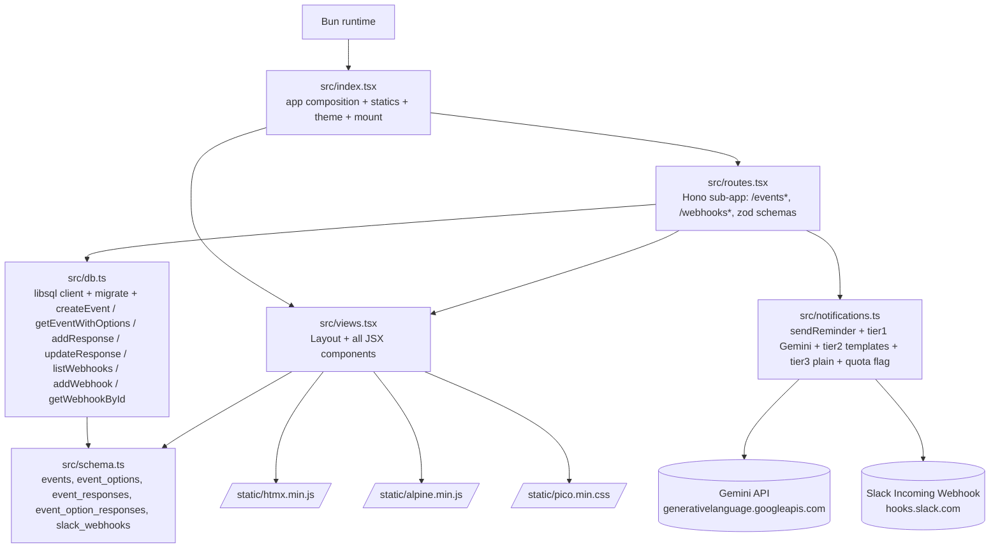
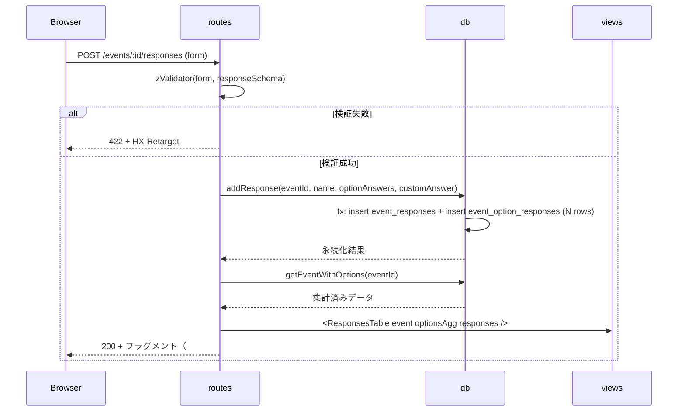
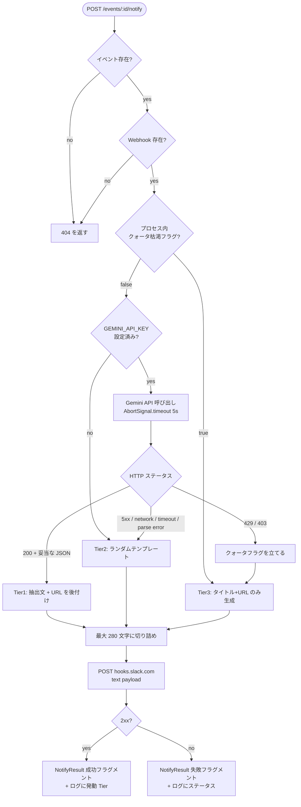
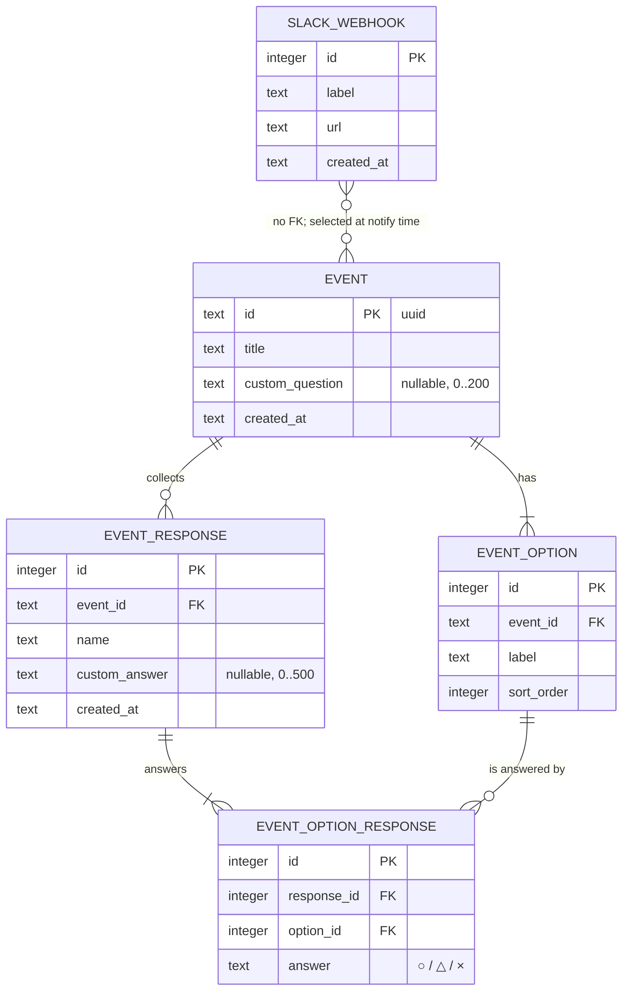
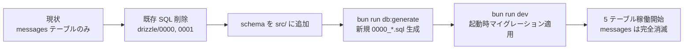

# Technical Design: tyousei-san

## Overview

**Purpose**: 「調整さん」相当の出欠調整機能に、本家にはない **任意のカスタム設問 1 件** と **Slack 催促通知（Gemini API による動的メッセージ生成 + 3 段フォールバック）** を加えた MVP を、本リポジトリの Bun + Hono + htmx + Drizzle + pico.css スタックで提供する。

**Users**: イベント主催者は `/events/new` から候補日時とカスタム設問を持つイベントを発行し、URL を共有する。参加者は認証なしで `/events/:id` を訪れて出欠（○/△/×）と設問への自由記述を回答する。主催者は `/webhooks` に Slack Incoming Webhook を登録しておき、イベントページから手動で催促を送信する。

**Impact**: 既存検証用のメッセージボード機能（`/messages` ハンドラ、`messages` テーブル、`MessageForm` / `MessageList`）は撤去し、本リポジトリは tyousei-san の単一機能アプリとして再構成する。`Layout`・`serveStatic` 規約・起動時マイグレーション・「フルページ vs フラグメント」規約は維持する。

### Goals

- 出欠調整の MVP（イベント発行 / 回答登録 / 回答更新 / 集計表示）を htmx 部分更新で完結させる
- カスタム設問 1 件を主催者が任意で追加でき、参加者の回答を一覧表示できる
- Slack 催促を Gemini API（無料枠）で動的生成し、**429/403 を検知したらプロセス内で Gemini 呼び出しを停止** して無料枠への追加リクエストを抑止する
- Alpine.js を htmx 補助としてのみ導入し、`<details>` 等で代替できる UI には使わない（プログレッシブエンハンスメント）
- 既存「フラットなレイヤー分割」哲学（structure.md）を踏襲し、レイヤー名のみで構成する（ドメイン接頭辞は付けない。アプリ全体が tyousei-san の単一機能だから）

### Non-Goals

- ユーザー認証・アカウント管理・アクセス制御
- イベント / 参加者の削除機能・コメント機能・メール通知
- Slack 以外のチャットツール（LINE / Discord / Teams）への送信
- スケジュール送信・cron 等の自動催促
- カスタム設問の複数追加・回答形式選択・事後編集
- Slack Webhook の OAuth 自動取得 / 催促メッセージのプレビュー編集
- Gemini レスポンスの履歴保存・キャッシュ・有料枠の利用
- 国際化（日本語のみ）

## Boundary Commitments

### This Spec Owns

- **HTTP ルート**: `GET /` / `GET /events/new` / `POST /events` / `GET /events/:id` / `POST /events/:id/responses` / `PUT /events/:id/responses/:responseId` / `GET /webhooks` / `POST /webhooks` / `POST /events/:id/notify`
- **データ**: `events` / `event_options` / `event_responses` / `event_option_responses` / `slack_webhooks` テーブルとマイグレーション SQL
- **ビュー**: 出欠調整・Webhook 用の JSX コンポーネント群（イベント作成 / 一覧表 / 回答フォーム / Webhook フォーム）
- **外部統合**: Gemini API クライアント（`fetch` ベース）と Slack Incoming Webhook クライアント、3 段フォールバックロジック、プロセス内クォータフラグ
- **共通シェル**: `Layout` を Alpine.js 読み込み + `htmx:afterSwap` リスナを含む形に拡張する責任を持つ

> **Webhook 機能の任意性**: Webhook + Slack 催促は **ユーザ操作レベルで任意**。フィーチャーフラグ（環境変数）は設けず、未登録なら `<NotifySection>` が `/webhooks` への誘導リンクのみを表示する（要件 8.8）。出欠調整本体は Webhook 設定なしでも完結する。

### Out of Boundary

- メッセージボード機能のコード資産（**撤去対象**であって維持対象ではない）
- Drizzle 以外の ORM への切替、libsql 以外の DB エンジン
- Gemini SDK（`@google/genai`）の採用 — 本 spec は `fetch` 直叩きで完結する
- Alpine.js の独自プラグイン開発・グローバルストア設計（MVP は `x-data` ローカル状態のみ）
- 集計表の仮想スクロール・サーバ送信イベント・WebSocket 等のリアルタイム配信
- 通知メッセージのテンプレート管理 UI（テンプレートはコード内定数）

### Allowed Dependencies

- 既存 npm 依存: `hono` / `@hono/zod-validator` / `zod` / `drizzle-orm` / `@libsql/client` / `pico.css` / `htmx.org`
- 新規 npm 依存: `alpinejs`
- 環境変数: `TURSO_DATABASE_URL` / `TURSO_AUTH_TOKEN` / `PORT` / `GEMINI_API_KEY` / `APP_BASE_URL`
- Bun ネイティブ: `fetch` / `crypto.randomUUID()` / `AbortSignal.timeout(ms)`

### Revalidation Triggers

- `Layout` のシグネチャ（props 型・読み込み JS の順序）変更 → すべての画面で動作確認
- `events.id` の生成方式変更（UUID → nanoid 等）→ URL・テスト・既存データの取り扱い再評価
- Gemini API のエンドポイント / モデル名 / 認証方式変更 → `notifications.ts` の契約とフォールバック条件再確認
- Slack Incoming Webhook URL の検証規則変更 → `slack_webhooks` 登録フローと既存データの整合性再確認
- DB クライアントの単一インスタンス契約の変更（複数クライアント化）→ テスト DB セットアップ全体の見直し

## Architecture

### Existing Architecture Analysis

- **撤去**: messageboard の全資産（テーブル / ハンドラ / JSX / マイグレーション SQL）を破棄。ファイル名（`index.tsx` / `views.tsx` / `db.ts` / `schema.ts`）と「フラットなレイヤー分割」哲学は引き継ぎ、中身を書き替える。
- **継承する規約**: 「初回 GET はフルページ / htmx はフラグメント」、`zValidator` + `HX-Retarget` でフォーム差し戻し、`db.ts` で単一 libsql クライアント + 起動時マイグレーション、`$inferSelect` でスキーマから型導出、`serveStatic` で `node_modules` 直配信、`Layout` 共通シェル、`parseTheme` 等のテーマ切替。
- **構造改善**: 既存 `index.tsx` がバリデーション・ハンドラ・差し戻しを縦に書いていた箇所を `routes.tsx`（Hono サブアプリ）に切り出し、`index.tsx` は「アプリ組み立て + `serveStatic` + テーマ + `app.route` マウント」だけに痩せさせる。

### Architecture Pattern & Boundary Map

採用パターン: **「フラットなレイヤー分割」（既存 structure.md 哲学そのまま）**。ドメイン接頭辞は付けず、レイヤー単位 6 ファイルを `src/` 直下に並べる。`routes.tsx` を Hono サブアプリとして切り出し、`src/index.tsx` は「アプリ組み立て + 静的配信 + テーマ + `app.route("/", routes)`」のみを担う。



**Architecture Integration**:

- **Pattern**: structure.md の「フラットなレイヤー分割」をそのまま適用。`src/` 直下にレイヤー単位 6 ファイル、ドメイン接頭辞は付けない。
- **New components**: ルート 9 個 + 新規 5 テーブル + JSX 8 種で既存より大きいため、`routes.tsx` を `index.tsx` から切り出す。Gemini と Slack をひとつのモジュール (`notifications.ts`) に閉じ込め、プロセス外依存のモック注入点を 1 箇所に集約する。
- **Steering compliance**: 新規依存は `alpinejs` のみ。Bun ネイティブ機能（`crypto.randomUUID` / `AbortSignal.timeout`）で外部 SDK を回避。

### Dependency Direction

`index.tsx` → `routes.tsx` → (`views.tsx` | `db.ts` | `notifications.ts`) → `schema.ts`

- `views.tsx` は `schema.ts` の型のみ。`db` / `routes` / Hono `Context` を import しない（既存規約）。
- `notifications.ts` は Web 標準 + `zod` のみ。`views` / `db` / `schema` に依存せず、ハンドラから入力を引数で受け取る。
- 逆向き依存（views → routes、schema → views など）は禁止。

### Technology Stack

| Layer                    | Choice / Version                      | Role in Feature                                                     | Notes                                                                                |
| ------------------------ | ------------------------------------- | ------------------------------------------------------------------- | ------------------------------------------------------------------------------------ |
| Frontend                 | htmx 2.x（既存）                      | フォーム送信・部分更新・`HX-Retarget`・`hx-indicator` で送信表示    | 既存パターンを踏襲                                                                   |
| Frontend                 | **Alpine.js 3.x（新規）**             | タブ / モーダル等のクライアント側状態管理（必要箇所のみ）           | `node_modules/alpinejs/dist/cdn.min.js` を `serveStatic` で配信。CDN 直リンク禁止    |
| Frontend                 | pico.css v2（既存）                   | セマンティック HTML ベースの装飾                                    | 独自 CSS を増やさない                                                                |
| Backend                  | Hono（既存）                          | ルーティング・サブアプリ合成（`app.route`）                         | `routes.tsx` をサブアプリとして切り出し合成                                          |
| Backend                  | Hono JSX（既存）                      | サーバ HTML 生成                                                    | `react` を import しない                                                             |
| Backend                  | zod + `@hono/zod-validator`（既存）   | 入力検証・型導出                                                    | 失敗時は `HX-Retarget` でフォームに差し戻し                                          |
| Data                     | drizzle-orm + libsql（既存）          | 5 テーブルの永続化、起動時マイグレーション                          | dialect は `"turso"` のまま                                                          |
| Messaging / External     | Gemini REST API（v1beta、軽量モデル） | 催促メッセージ本文を都度生成                                        | `gemini-2.5-flash-lite` を既定。`fetch` + zod パース。SDK は採用しない（依存最小化） |
| Messaging / External     | Slack Incoming Webhook                | 催促メッセージの投稿                                                | `{ "text": "..." }` の最小ペイロード                                                 |
| Infrastructure / Runtime | Bun（既存）                           | HTTP / ホットリロード / `crypto.randomUUID` / `AbortSignal.timeout` | Bun ネイティブで完結                                                                 |

詳細な選定理由（モデル名・無料枠制限・Alpine.js 統合パターン・ID 生成方式・SDK 非採用理由）は `research.md` を参照。

## File Structure Plan

### Directory Structure

```
src/
├── index.tsx        # アプリ組み立て + serveStatic（htmx / alpine / pico）+ GET / (302) + POST /theme + app.route("/", routes)
├── routes.tsx       # Hono サブアプリ。/events*, /webhooks*, /events/:id/notify の 9 ハンドラ + zod schemas
├── views.tsx        # Layout + Theme 型 + 全 JSX コンポーネント（規模に応じて分割可・下記）
├── db.ts            # 単一 libsql クライアント + 起動時 migrate + 全クエリ関数（createEvent / addResponse / listWebhooks 等）
├── schema.ts        # events / event_options / event_responses / event_option_responses / slack_webhooks + $inferSelect 型
├── notifications.ts # sendReminder + Gemini クライアント + Slack クライアント + 3 段フォールバック + プロセス内クォータフラグ
└── *.test.ts        # 各ファイルと同じ階層

drizzle/             # 既存 0000_/0001_ SQL は削除し、`bun run db:generate` で tyousei スキーマの新規初回マイグレーションを再生成
```

**命名方針**: messageboard を完全撤去するため、既存 4 ファイル（`index.tsx` / `views.tsx` / `db.ts` / `schema.ts`）の中身は破棄して書き直す。ファイル名と「フラット + レイヤー分割」哲学は引き継ぐ。新規追加は `routes.tsx` と `notifications.ts` の 2 ファイルのみ。`package.json` に `alpinejs` を追加。

**views 分割ルール**: 既定は単一 `views.tsx`。300 行超 / 1 ルート族（events / webhooks / notify）が独立してテスト可能、のいずれかで `views-events.tsx` / `views-webhooks.tsx` / `views-notify.tsx` への分割を許容。分割後も `Layout` と共有部品（`NotFoundPage` 等）は `views.tsx` に残し、views 間は共有部品の片方向 import のみ（循環禁止）。依存方向（`routes → views-* → schema`）と「`Context` / `db` を views から import しない」規約は不変。判断は Phase 4 リファクタリングで行う。

## System Flows

### イベント回答登録フロー（フラグメント差し替え）



差し戻しは `HX-Retarget` でフォーム要素のみ差し替え、集計表とフォーム以外の DOM は維持する。

### Slack 催促送信と 3 段フォールバック



**Key behavior**: Slack 送信失敗（2xx 以外）は **フォールバック対象外** — エラーフラグメントを返してサーバログに記録（要件 8.11）。Gemini の失敗分岐はフローチャート参照。

## Requirements Traceability

| Requirement | Summary                                                                                        | Components                   | Key Interfaces                                                          | Flows          |
| ----------- | ---------------------------------------------------------------------------------------------- | ---------------------------- | ----------------------------------------------------------------------- | -------------- |
| 1.1–1.6     | イベント作成のフルページ・永続化・302・推測困難 ID・422 差し戻し                               | routes, db, views            | `GET/POST /events`, `createEvent` (uuid), zod `eventCreateSchema`       | —              |
| 1.7–1.9     | カスタム設問の保存・空時 null・200 文字制限                                                    | routes, db                   | `POST /events` の `customQuestion`, `events.custom_question`            | —              |
| 2.1–2.5     | イベント閲覧フルページ・404・空状態・○△× 集計・登録順                                          | routes, views, db            | `GET /events/:id`, `getEventWithOptions`, `<ResponsesTable/>`           | —              |
| 2.6–2.7     | カスタム設問列の条件付き表示                                                                   | views                        | `<ResponsesTable/>` 分岐                                                | —              |
| 3.1–3.6     | 回答登録 + バリデーション + フラグメント返却                                                   | routes, db, views            | `POST /events/:id/responses`, `addResponse`, `responseSchema`, ○△× enum | 回答登録フロー |
| 3.7–3.10    | カスタム設問の入力欄・空文字許容・500 文字制限・条件付き非表示                                 | routes, views                | `<ResponseFormRow/>` 分岐, `customAnswer` バリデーション                | —              |
| 4.1–4.5     | 既存参加者の編集モード + PUT で上書き                                                          | routes, db, views            | `PUT /events/:id/responses/:responseId`, `updateResponse`               | —              |
| 5.1–5.5     | フルページ vs フラグメント規約 + 依存方向 + zValidator                                         | routes                       | API 全体, `zValidator` callback                                         | 回答登録フロー |
| 5.6–5.9     | messageboard 撤去・出欠調整専用テーブル・Layout 拡張・`GET /` 302                              | schema, index.tsx, views.tsx | `Layout` (Alpine + htmx 配線), `GET /` (302)                            | —              |
| 6.1–6.8     | スキーマ・型導出・FK cascade・カスタム列・slack_webhooks                                       | schema                       | 5 tables, `$inferSelect`                                                | —              |
| 7.1–7.7     | カスタム設問の制約 + XSS 防止                                                                  | routes, views                | zod schemas, Hono JSX 自動エスケープ                                    | —              |
| 8.1–8.6     | Webhook CRUD・URL 検証・マスク表示                                                             | routes, views, db            | `GET/POST /webhooks`, `webhookSchema`, `<WebhooksPage/>`, `addWebhook`  | —              |
| 8.7–8.12    | イベントから催促送信 + 成功/失敗フラグメント + 404                                             | routes, views, notifications | `POST /events/:id/notify`, `sendReminder`, `<NotifyResult/>`            | Slack 催促送信 |
| 8.13–8.27   | Gemini プロンプト構築・5 秒 timeout・3 段フォールバック・クォータフラグ・テンプレート 3 件以上 | notifications                | `sendReminder` (tier 分岐), `AbortSignal.timeout(5000)`, prompt 構築    | Slack 催促送信 |
| 8.28–8.29   | `hx-indicator` 表示・発動 Tier をログ出力                                                      | views, notifications         | `<NotifySection/>` の `hx-indicator`, `console.warn` 出力               | —              |
| 9.1–9.5     | `<label>`・viewport・タップ領域・WCAG AA                                                       | views                        | pico.css セマンティック HTML                                            | —              |
| 10.1–10.8   | Alpine.js の `x-*` 利用・`htmx:afterSwap` 再初期化・PE 担保                                    | views                        | `Layout` script, `<EventNewForm/>` の `x-data` 等                       | —              |

## Components and Interfaces

### Component Summary

| Component      | Domain/Layer          | Intent                                                                                          | Req Coverage            | Key Dependencies (P0/P1)                | Contracts |
| -------------- | --------------------- | ----------------------------------------------------------------------------------------------- | ----------------------- | --------------------------------------- | --------- |
| index          | App Composition       | Hono アプリ組み立て・`serveStatic`・テーマ切替・サブアプリマウントだけを担う薄いエントリ        | 5.9                     | routes (P0), views Layout (P1)          | —         |
| routes         | HTTP / Orchestration  | 出欠調整・Webhook の Hono サブアプリ。zValidator → db → views の薄いハンドラ群                  | 1, 2, 3, 4, 5, 7, 8     | db (P0), views (P0), notifications (P0) | API       |
| views          | Presentation          | フルページとフラグメントの両方の JSX を提供                                                     | 1, 2, 3, 4, 5, 7, 9, 10 | schema 型 (P0)                          | —         |
| db             | Persistence           | libsql クライアント・起動時 migrate・全テーブルへのクエリ関数・トランザクション境界             | 1, 2, 3, 4, 6, 7, 8     | schema (P0), drizzle-orm + libsql (P0)  | Service   |
| schema         | Data                  | Drizzle テーブル定義と `$inferSelect` 型エクスポート                                            | 6, 7, 8                 | drizzle-orm/sqlite-core (P0)            | State     |
| notifications  | External Integration  | Gemini + Slack をひとつの境界に閉じ込め、3 段フォールバック・タイムアウト・クォータフラグを担う | 8                       | Web fetch (P0), zod (P1)                | Service   |
| Layout (views) | Presentation (shared) | htmx / Alpine / pico の読み込みと `htmx:afterSwap` 再初期化リスナを集約する共通シェル           | 5, 10                   | htmx 2.x (P0), Alpine.js 3.x (P0)       | —         |

### HTTP / Orchestration

#### routes

| Field        | Detail                                                                           |
| ------------ | -------------------------------------------------------------------------------- |
| Intent       | tyousei ドメインのルーティングと薄いハンドラ群を Hono サブアプリとして提供する。 |
| Requirements | 1.1–1.9, 2.1–2.7, 3.1–3.10, 4.1–4.5, 5.1–5.9, 7.1–7.7, 8.1–8.12                  |

**Responsibilities & Constraints**

- すべての入力検証を `zValidator` で行い、ハンドラ内に手書きの型ガードを増やさない。
- 失敗時は `c.header("HX-Retarget", "#xxx")` でフォームに差し戻し、入力値を保持して 422 を返す（要件 1.3 / 3.2 / 8.3 / 8.4）。
- 初回 GET (`/events/new` / `/events/:id` / `/webhooks`) はフルページ、htmx ミューテーション (`POST /events` 以外の POST / PUT) はフラグメントを返す（要件 5.1 / 5.2）。`POST /events` は永続化後に 302 で `/events/:id` にリダイレクト（要件 1.2）。
- `notifications.sendReminder` を引数として受け取れる構造（テスト時にモック注入できる）にする。

**Dependencies**

- Inbound: `src/index.tsx` の `app.route("/", routes)` — マウント (P0)
- Outbound: `db` — データアクセス (P0)、`views` — レンダリング (P0)、`notifications` — Slack 催促送信 (P0)
- External: なし（外部 API は notifications に閉じる）

**Contracts**: Service [ ] / **API [x]** / Event [ ] / Batch [ ] / State [ ]

##### API Contract

| Method | Endpoint                            | Request                                                                         | Response                                           | Errors                                                                   |
| ------ | ----------------------------------- | ------------------------------------------------------------------------------- | -------------------------------------------------- | ------------------------------------------------------------------------ |
| GET    | `/`                                 | —                                                                               | 302 Location `/events/new`                         | —                                                                        |
| GET    | `/events/new`                       | —                                                                               | 200 フルページ (`<Page><EventNewForm/></Page>`)    | —                                                                        |
| POST   | `/events`                           | form: `title`, `options[]`, `customQuestion?` （**非 htmx・通常フォーム送信**） | 302 Location `/events/:id`（ブラウザがナビゲート） | 422 フルページ（`<EventNewForm/>` を `<Layout>` 内に再描画、入力値保持） |
| GET    | `/events/:id`                       | —                                                                               | 200 フルページ                                     | 404                                                                      |
| POST   | `/events/:id/responses`             | form: `name`, `answers[<optionId>]=○\|△\|×`, `customAnswer?`                    | 200 フラグメント `<ResponsesTable/>`               | 404 / 422 (`HX-Retarget` `#response-form`)                               |
| PUT    | `/events/:id/responses/:responseId` | form: 同上                                                                      | 200 フラグメント `<ResponsesTable/>`               | 404 / 422                                                                |
| GET    | `/webhooks`                         | —                                                                               | 200 フルページ (`<WebhooksPage/>`)                 | —                                                                        |
| POST   | `/webhooks`                         | form: `label`, `url`                                                            | 200 フラグメント `<WebhooksList/>`                 | 422 (`HX-Retarget` `#webhook-form`)                                      |
| POST   | `/events/:id/notify`                | form: `webhookId`                                                               | 200 フラグメント `<NotifyResult/>`                 | 404 / 500-on-slack-fail フラグメント                                     |

zod schemas（要点。すべて `z.string().trim()` ベース）:

| Schema              | フィールド                                                                                         |
| ------------------- | -------------------------------------------------------------------------------------------------- |
| `eventCreateSchema` | `title`: 1..200 / `options`: 1+ 件、各 1..200、重複なし（`.refine`）/ `customQuestion?`: 0..200    |
| `responseSchema`    | `name`: 1..100 / `answers`: `Record<optionId, "○"\|"△"\|"×">`（`z.enum`）/ `customAnswer?`: 0..500 |
| `webhookSchema`     | `label`: 1..100 / `url`: `^https://hooks.slack.com/` で始まる                                      |
| `notifySchema`      | `webhookId`: 1+                                                                                    |

**Implementation Notes**

- **htmx 適用範囲**: `POST /events` だけは **htmx を使わない通常フォーム送信**（`<form method="post" action="/events">`）。成功時は 302 でブラウザがナビゲート、422 時はサーバが `<EventNewForm/>` を `<Layout>` 内に包んだフルページを返す（`HX-Retarget` ではない）。これは要件 1.2 の「リダイレクト」と要件 1.3 の「入力値保持」を htmx 非依存で両立するため。他のミューテーション（`POST /events/:id/responses` / `PUT .../:responseId` / `POST /webhooks` / `POST /events/:id/notify`）は htmx 経由でフラグメント返却。
- `src/index.tsx` で `app.route("/", routes)` 合成、`/static/alpine.min.js` の `serveStatic` も同所追加。
- ハンドラは `zValidator("form", schema, errorCallback)` で完結。PUT は htmx `hx-put` 前提（PE 上の POST + メソッドオーバーライド案は MVP では採用せず、要件 10.8 の再評価は個別タスクで行う）。

### Presentation

#### views

| Field        | Detail                                                                                                                                                                                                                                                       |
| ------------ | ------------------------------------------------------------------------------------------------------------------------------------------------------------------------------------------------------------------------------------------------------------ |
| Intent       | tyousei ドメインのフルページとフラグメントを JSX として提供する。`Context` / `db` を import しない。**規模に応じて `views.tsx` / `views-events.tsx` / `views-webhooks.tsx` / `views-notify.tsx` に分割可（File Structure Plan 「views 分割ルール」参照）**。 |
| Requirements | 1.1, 2.1, 2.3, 2.6, 2.7, 3.7, 3.10, 4.1, 4.5, 5.1–5.5, 7.3, 7.4, 8.1, 8.5, 8.7, 8.8, 8.10, 8.11, 9.1–9.5, 10.1, 10.5, 10.7                                                                                                                                   |

**Components Provided**:

- `<EventNewForm values? errors?>` — タイトル / 候補日時動的追加 / カスタム設問入力。Alpine.js で「候補行の追加・削除」のクライアント状態を `x-data` で扱う。
- `<EventPage event options responses webhooks>` — `<Layout>` 内包のフルページ。`<ResponsesTable/>` と `<ResponseFormRow/>` と `<NotifySection/>` を含む。
- `<ResponsesTable event options responses>` — 集計表（参加者行 × 候補列 + ○△× 集計行）+ カスタム設問列（条件付き）。htmx `outerHTML` で `#responses` に差し替えられる。
- `<ResponseFormRow event options values? errors? mode="create"|"edit" responseId?>` — 名前 + 候補ごとのラジオ + カスタム設問の自由記述。`HX-Retarget` で `#response-form` に差し戻し可能。
- `<WebhooksPage webhooks values? errors?>` — フルページ。マスク済み URL 一覧 + 登録フォーム。
- `<WebhooksList webhooks>` — フラグメント。新規登録後の差し替え対象。
- `<NotifySection event webhooks>` — Webhook が 0 件ならリンクのみ、1 件以上ならセレクタ + 送信ボタン + `hx-indicator`。
- `<NotifyResult kind="success"|"error" message>` — 送信結果フラグメント。
- `<NotFoundPage message>` — 404 用フルページ。

**Responsibilities & Constraints**

- props のみで描画。`Context` / `db` を import しない（要件 5.3）。
- Hono JSX の自動エスケープに依存して XSS を防ぐ（要件 7.7）。`dangerouslySetInnerHTML` は使わない。
- pico.css のセマンティック要素（`<main class="container">` / `<article>` / `<form role="group">`）を優先し、独自クラスを増やさない（要件 9.4）。
- Alpine.js は **クライアント側状態がどうしても必要な箇所のみ** に使う（候補日時の動的追加、`<NotifySection>` の Webhook 選択 UI 等）。単純な開閉は `<details>` で代替する（要件 10.5）。
- フラグメント内ルート要素には htmx `outerHTML` 用の固定 `id` を付ける（`#responses` / `#webhooks-list` / `#notify-result` / `#event-form` / `#response-form` / `#webhook-form`）。

**Dependencies**

- Inbound: `routes` — 描画呼び出し (P0)
- Outbound: `schema` の `$inferSelect` 型 (P0)、`src/views.tsx` の `Layout` (P1)
- External: なし

**Contracts**: ない（プレゼンテーション層）。Layout のシグネチャ拡張は別途下記参照。

**Implementation Notes**: `Layout` を `views.tsx` から import し props でタイトル等を渡す。入力値の表示は props で受け取った値のみ使い書き換えない。MVP では集計表サイズ（候補 × 参加者）の上限を緩く扱い、性能テストは別 spec で扱う。

### Persistence

#### db

| Field        | Detail                                                                   |
| ------------ | ------------------------------------------------------------------------ |
| Intent       | tyousei テーブル群のクエリ・トランザクションを集約する。                 |
| Requirements | 1.2, 1.6, 1.7, 1.8, 2.1, 2.4, 2.5, 3.1, 3.5, 4.2, 6.1–6.8, 7.1, 8.2, 8.6 |

**Responsibilities & Constraints**

- 入出力は `$inferSelect` 派生型で表現。Hono / Web 依存を一切 import しない。
- イベント作成と回答登録は **単一トランザクション** で複数テーブル挿入（`events` + `event_options` / `event_responses` + `event_option_responses`）。
- 集計は `getEventWithOptions` 内でクエリ + サーバ側 reduce。テスト時は実 DB で検証。
- イベント ID は `crypto.randomUUID()`（research.md Decision）。

**Dependencies**

- Inbound: `routes` (P0)
- Outbound: `schema` (P0)
- External: `drizzle-orm/libsql` の `drizzle()` / `migrate()` (P0)

**Contracts**: **Service [x]** / API [ ] / Event [ ] / Batch [ ] / State [ ]

##### Service Interface

```typescript
import type {
  events,
  eventOptions,
  eventResponses,
  eventOptionResponses,
  slackWebhooks,
} from "./schema";

type Event = typeof events.$inferSelect;
type EventOption = typeof eventOptions.$inferSelect;
type EventResponse = typeof eventResponses.$inferSelect;
type EventOptionResponse = typeof eventOptionResponses.$inferSelect;
type SlackWebhook = typeof slackWebhooks.$inferSelect;

type Answer = "○" | "△" | "×";

interface CreateEventInput {
  title: string;
  options: string[]; // 重複なし、各空文字なし、配列長 >= 1（呼び出し前に validate 済み前提）
  customQuestion: string | null;
}

interface ResponseInput {
  name: string;
  answers: Record<string, Answer>; // key: eventOptions.id
  customAnswer: string | null;
}

interface EventWithOptions {
  event: Event;
  options: EventOption[];
  responses: Array<EventResponse & { answers: Record<string, Answer> }>;
  aggregates: Record<string, { circle: number; triangle: number; cross: number }>;
}

interface TyouseiDb {
  createEvent(input: CreateEventInput): Promise<{ id: string }>;
  getEventWithOptions(id: string): Promise<EventWithOptions | null>;
  addResponse(eventId: string, input: ResponseInput): Promise<{ responseId: number }>;
  updateResponse(eventId: string, responseId: number, input: ResponseInput): Promise<boolean>;
  listWebhooks(): Promise<SlackWebhook[]>;
  addWebhook(input: { label: string; url: string }): Promise<{ id: number }>;
  getWebhookById(id: number): Promise<SlackWebhook | null>;
}
```

- **Preconditions**: 入力は zod 検証済み。`addResponse` / `updateResponse` の `answers` のキーは `getEventWithOptions(eventId).options[].id` のみであることをハンドラが保証。
- **Postconditions**: `createEvent` / `addResponse` は関連テーブルを同一 tx で挿入し、片方だけ残らない。
- **Invariants**: 全 FK に `onDelete: "cascade"`。

**Implementation Notes**: テストは `TURSO_DATABASE_URL=":memory:"` を `db` 動的 import 前に設定（既存規約）。`event_option_responses` の挿入は `insert(...).values(array)` でバッチ化。

### Data Layer

#### schema

| Field        | Detail                                               |
| ------------ | ---------------------------------------------------- |
| Intent       | Drizzle テーブル定義と `$inferSelect` 型を集約する。 |
| Requirements | 6.1–6.8, 7.1, 7.5, 8.6                               |

**Contracts**: Service [ ] / API [ ] / Event [ ] / Batch [ ] / **State [x]**

##### State Management

詳細は「Data Models / Physical Data Model」セクション参照。要点のみ:

- 5 テーブル: `events` / `event_options` / `event_responses` / `event_option_responses` / `slack_webhooks`
- FK 全て `onDelete: "cascade"`（要件 6.4）
- 型は `typeof xxx.$inferSelect` / `$inferInsert` で導出（要件 6.5）
- `events.customQuestion` は nullable text（要件 6.6）
- `event_responses.customAnswer` は nullable text、空文字は許容（要件 6.7 / 7.6）

### External Integration

#### notifications

| Field        | Detail                                                                                    |
| ------------ | ----------------------------------------------------------------------------------------- |
| Intent       | Gemini と Slack のプロセス外依存を 1 モジュールに閉じ込め、3 段フォールバックを管理する。 |
| Requirements | 8.9, 8.10, 8.11, 8.13–8.27, 8.29                                                          |

**Responsibilities & Constraints** (Tier 分岐自体はフローチャート参照)

- `sendReminder` が唯一の公開エントリ。Gemini / Slack クライアントは関数引数で注入可能（テストでモック差し込み）。
- Gemini 呼び出しは `AbortSignal.timeout(5000)`、レスポンスは zod でパース、抽出文末尾に URL を後付け、最終本文を 280 文字に切り詰め（要件 8.18 / 8.19 / 8.27）。
- プロンプト: `systemInstruction` に固定指示、`contents.parts` 内でイベントタイトルをバッククォート 3 連で囲んでユーザ入力として渡す（要件 8.14 / 8.15）。
- フォールバックテンプレートは **3 件以上** をコード内定数で保持しランダム選択（要件 8.26）。
- `geminiQuotaExhausted` をモジュールレベル `let` で保持。429 / 403 検知で `true` を立て、以降は Gemini を呼ばず Tier 3 直行（要件 8.24 / 8.25）。
- 送信完了時、発動 Tier を `console.warn` で出力（要件 8.29）。Slack 送信失敗（2xx 以外）はフォールバック対象外、`{ ok: false, status }` を返す（要件 8.11）。
- API キーは `GEMINI_API_KEY`、URL は `APP_BASE_URL` から取得。ハードコード禁止（要件 8.16 / 8.17）。

**Dependencies**

- Inbound: `routes` の `POST /events/:id/notify` ハンドラ (P0)
- Outbound: なし
- External: Gemini API (`https://generativelanguage.googleapis.com/v1beta/models/gemini-2.5-flash-lite:generateContent`) (P0)、Slack Incoming Webhook (`https://hooks.slack.com/...`) (P0)

**Contracts**: **Service [x]** / API [ ] / Event [ ] / Batch [ ] / State [ ]

##### Service Interface

```typescript
type Tier = "tier1" | "tier2" | "tier3";

interface SendReminderInput {
  eventTitle: string;
  eventUrl: string; // 完全な URL（host + /events/:id）
  webhookUrl: string;
}

interface SendReminderResult {
  ok: boolean; // Slack 送信成功 (2xx) なら true
  tier: Tier;
  status?: number; // 失敗時の Slack ステータス
}

interface GeminiClient {
  generate(prompt: GeminiPrompt, signal: AbortSignal): Promise<string>; // 失敗時は throw
}

interface SlackClient {
  post(url: string, payload: { text: string }): Promise<{ ok: boolean; status: number }>;
}

interface NotificationsDeps {
  gemini?: GeminiClient; // 未注入時は本物の fetch クライアントを使う
  slack?: SlackClient;
  apiKey?: string; // 既定: process.env.GEMINI_API_KEY
  now?: () => Date; // テスト用
}

function sendReminder(
  input: SendReminderInput,
  deps?: NotificationsDeps,
): Promise<SendReminderResult>;

// テスト用ヘルパ
function resetQuotaFlag(): void;
```

- **Preconditions**: `eventUrl` は host 含む完全な URL。`webhookUrl` は `https://hooks.slack.com/` 前提（呼び出し側で検証済み）。
- **Postconditions**: `tier === "tier3"` のとき `geminiQuotaExhausted = true`。
- **Invariants**: 一度 `tier3`（クォータ枯渇）が記録されたら `resetQuotaFlag()` を呼ばない限り `tier1` に戻らない（プロセス内）。

**Implementation Notes**

- **本番クライアントの供給**: `notifications.ts` 内に `defaultGeminiClient` / `defaultSlackClient` をモジュール定数として lazy-init で保持し、`sendReminder` は `deps` 未指定なら既定クライアントを使う。`process.env.GEMINI_API_KEY` は **`sendReminder` 呼び出し時に都度参照**（モジュール load 時には参照しない）— 起動時に未設定でも import が壊れない。
- **呼び出し方**: 本番は `await sendReminder({ eventTitle, eventUrl, webhookUrl })`（deps なし）。テストは `await sendReminder(input, { gemini: mockGemini, slack: mockSlack })` の形でモックを差し込む。
- `eventUrl` は `${APP_BASE_URL}/events/${eventId}` で `routes` 側が組み立て。Gemini レスポンスは zod パース、形式不正は Tier 2（要件 8.23）。`AbortSignal.timeout(5000)` のテストは `signal.aborted` を強制発火（実 API は呼ばない）。

### Presentation (Shared)

#### Layout (existing, extended)

| Field        | Detail                                                                                                      |
| ------------ | ----------------------------------------------------------------------------------------------------------- |
| Intent       | アプリ全体の HTML シェル。htmx / Alpine.js / pico.css を読み込み、`htmx:afterSwap` で Alpine 再初期化する。 |
| Requirements | 5.1, 5.8, 9.1–9.5, 10.2, 10.3, 10.4, 10.8                                                                   |

**Responsibilities & Constraints**

- `<head>` に htmx → Alpine の順で `defer` 読み込み（要件 10.3）。`<body>` 末尾に 1 つのインラインスクリプトで `document.body.addEventListener("htmx:afterSwap", (e) => window.Alpine?.initTree(e.detail.target))` を登録（要件 10.4 / 10.8 の `?.` ガード）。
- 既存のテーマ切替ボタンは messageboard 撤去後も汎用機能として維持。CSP 厳格化時にインラインスクリプトを外部 JS 化（research.md Decision）。

## Data Models

### Domain Model



- **集約**: `Event` を集約ルートとし、`EventOption` / `EventResponse` / `EventOptionResponse` は `Event` に従属。`SlackWebhook` は独立集約（イベントとの FK なし、催促送信時に選択）。
- **Invariants**: 候補日時は 1 イベントに 1 件以上で、ラベルは同一イベント内で空文字不可・重複不可（要件 1.4 / 1.5）。`answer` は `○` / `△` / `×` のみ（要件 3.6）。カスタム設問は 1 イベントに最大 1 件、設問文 1..200、設問への回答 0..500（要件 7.1 / 7.5 / 7.6）。

### Physical Data Model

drizzle-orm + sqlite-core で定義（`src/schema.ts`）。代表として `events` のみ示し、他は同パターン:

```typescript
export const events = sqliteTable("events", {
  id: text("id").primaryKey(), // uuid
  title: text("title").notNull(),
  customQuestion: text("custom_question"), // nullable, 0..200
  createdAt: text("created_at")
    .notNull()
    .default(sql`(datetime('now'))`),
});
export type Event = typeof events.$inferSelect;
```

| Table                    | PK                | 主な列                                                                                 | 索引                            |
| ------------------------ | ----------------- | -------------------------------------------------------------------------------------- | ------------------------------- |
| `events`                 | `id text`         | `title`, `custom_question?`, `created_at`                                              | PK 自動                         |
| `event_options`          | `id integer auto` | `event_id → events`, `label`, `sort_order`                                             | `event_id`                      |
| `event_responses`        | `id integer auto` | `event_id → events`, `name`, `custom_answer?`, `created_at`                            | `event_id`                      |
| `event_option_responses` | `id integer auto` | `response_id → event_responses`, `option_id → event_options`, `answer ("○"\|"△"\|"×")` | `response_id`, `option_id`      |
| `slack_webhooks`         | `id integer auto` | `label`, `url`, `created_at`                                                           | PK 自動（MVP 規模では追加不要） |

全 FK は `onDelete: "cascade"`（要件 6.4）。`answer` の 3 値制約は zod で担保し、必要なら drizzle の CHECK 制約も追加。索引は drizzle `index()` で定義。

**Consistency**: イベント作成と回答登録は `db.transaction()` で複数テーブルを同一 tx 挿入。`events.id` は `crypto.randomUUID()`（122 ビット、要件 1.6）。カスケード削除は要件 6.4 のため設定するが、本 spec ではイベント削除機能を提供しない（将来の整合性を保証するのみ）。

### Data Contracts & Integration

- **イベント URL 形式**: `${APP_BASE_URL}/events/${uuid}`。`notifications` が組み立てて Gemini プロンプトと Slack 本文の両方で同じ文字列を使う。
- **Gemini リクエスト**（v1beta `generateContent`）: `systemInstruction.parts[].text` に固定指示「Slack 投稿向け 1 行コピーライター、思わずクリックしたくなる小粋で短い催促文を 1 つ、日本語、絵文字 1 つまで、URL は本文に含めない」。`contents[].parts[].text` でイベントタイトルをバッククォート 3 連で囲んでユーザ入力として渡し、催促文の生成を依頼する。
- **Gemini レスポンスのパース**: `candidates[0].content.parts[0].text` を trim → zod で構造検証 → 末尾に URL を後付け連結。不正形式は Tier 2。
- **Slack ペイロード**: `{ "text": "<最終本文(280 文字以内、URL 末尾)>" }`。

## Error Handling

### Error Strategy

| カテゴリ                      | 戻り値 / 動作                                                                     | 要件                                        |
| ----------------------------- | --------------------------------------------------------------------------------- | ------------------------------------------- |
| 入力検証エラー (422)          | `HX-Retarget` でフォームに差し戻し、入力値を保持してエラーメッセージを表示        | 1.3, 1.4, 1.5, 1.9, 3.2, 3.3, 3.9, 8.3, 8.4 |
| イベント / Webhook 不在 (404) | `<NotFoundPage/>` のフルページ（GET）またはエラーフラグメント（POST/PUT）         | 2.2, 3.4, 4.3, 8.12                         |
| Gemini 一時的失敗             | Tier 2（テンプレート）にフォールバックし、エラー内容をサーバログに記録            | 8.23                                        |
| Gemini クォータ枯渇 (429/403) | Tier 3（タイトル + URL のみ）にフォールバックし、プロセス内クォータフラグを立てる | 8.24, 8.25                                  |
| Slack 送信失敗 (2xx 以外)     | `<NotifyResult kind="error"/>` フラグメントを返し、ステータスをサーバログに記録   | 8.11                                        |
| 想定外のサーバエラー          | Hono の標準エラーハンドラに任せ 500 を返す。トレースは標準出力に出す              | —                                           |

### Monitoring

構造化ログは未導入（MVP）。`console.warn` / `console.error` で標準出力に出す。必須イベント: Gemini 一時的失敗（理由 + status）/ Gemini 429・403（クォータフラグ起動）/ 発動 Tier（`tier1` / `tier2` / `tier3`、要件 8.29）/ Slack 送信失敗（status + webhook id、要件 8.11）。

## Testing Strategy

古典派 TDD（`.claude/rules/testing/test-philosophy.md`）に従う。DB は実体 + `beforeEach` クリーンアップ、Gemini / Slack はモック注入。

- **Unit / 統合（`bun test`）**
  - `db.test.ts`: イベント作成・回答登録の tx 完整性、`getEventWithOptions` の ○/△/× 集計と登録順、`event_option_responses` 件数 = `options` 長
  - `notifications.test.ts`: Tier 1 で URL 末尾連結、Tier 2 のテンプレ採用（5xx / parse fail / `GEMINI_API_KEY` 未設定）、Tier 3 + クォータフラグ（429）で次回も Gemini 不呼出し、Slack 失敗で `{ ok: false, status }`
  - `routes.test.ts`: `POST /events` 302、`POST /events/:id/responses` がフラグメント返却、422 時の `HX-Retarget` + 入力値保持
  - イベント作成→回答→編集→集計のフローを `app.request` 経由で実 DB + 実ハンドラで検証
- **E2E（`@playwright/test`、`tests/e2e/`）**
  - `events.spec.ts`: イベント作成 → 出欠 + カスタム設問の回答 → 集計表示
  - `webhooks.spec.ts`: Webhook 登録 → 一覧（URL マスク済み）
  - 異常系: 不在イベント URL は 404、候補 0 件は差し戻し。`truncateAll()` を `beforeEach` で実行。
- **Performance / Load**: MVP では未対応（要件にも目標なし）。

## Security Considerations

- **XSS 対策**: Hono JSX は文字列補間時に自動エスケープする。`dangerouslySetInnerHTML` を使わない（要件 7.7）。
- **プロンプトインジェクション対策**: イベントタイトルは `contents.parts` 内でバッククォート 3 連で囲み、`systemInstruction` には固定指示のみを置く（要件 8.15）。タイトルが指示文として解釈されても、Slack に送る本文は 280 文字に切り詰め + URL 後付けで暴走を抑える。
- **API キーの管理**: `GEMINI_API_KEY` は環境変数経由のみ。リポジトリ・ログ・エラーメッセージに含めない（要件 8.16）。
- **Slack URL の漏洩抑止**: 画面表示は **末尾の数文字以外を `*` でマスク** する（要件 8.5）。マスク文字列はサーバ側で生成し、フロントには元 URL を渡さない。
- **アクセス制御**: 仕様上「URL を知る誰でも閲覧・回答可能」（要件 Out of scope）。推測困難な uuid で生 URL の流出が攻撃面となるため、URL 共有時の取り扱いは運用ガイドラインで補完する。

## Migration Strategy



- 検証段階のため既存データの保持は不要。`local.db` / Turso DB の `messages` テーブルは捨てて構わない。
- 本番運用が始まっていない MVP なので、ロールバックは旧コミットへの `git checkout` で十分。
- 検証チェックポイント: 起動時に 5 テーブルが作成されること、`bun test` 全件 PASS、`bun run db:studio` でテーブル構造を目視確認。
